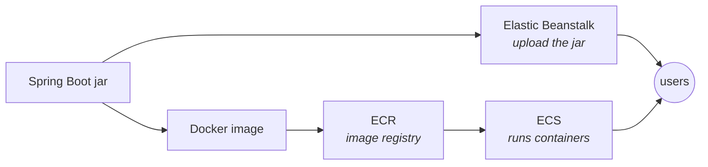

# ☁️ Deploying Spring Boot to AWS

**Elastic Beanstalk, RDS, ECR and ECS — the path from a JAR on your laptop to a running service.**

Assumes the [Docker note](../docker/docker-interview-revision.md). The ECS half is much easier if you have also read the [Kubernetes note](../kubernetes/kubernetes-interview-revision.md) — the ideas map almost one to one.

<sub>`Last updated: 2 Oct 2026`</sub>

**Contents** — [1 What is cloud](#1-what-is-cloud-and-which-one) · [2 Account and IAM](#2-aws-account-and-iam) · [3 Three ways to deploy](#3-three-ways-to-deploy-a-spring-boot-app) · [4 Elastic Beanstalk](#4-elastic-beanstalk) · [5 RDS](#5-adding-a-database-with-rds) · [6 ECR and ECS](#6-ecr-and-ecs) · [7 Costs](#7-costs) · [8 Debugging](#8-debugging) · [9 Mistakes](#9-mistakes-people-make) · [10 Q&A](#10-questions-and-answers) · [11 Practice](#11-practice-tasks)

---

## 1. What is cloud, and which one

Instead of buying a server, you rent someone else's and pay for what you use. What you actually get:

| | Your own server | Cloud |
|---|---|---|
| Getting a machine | Order, wait, rack it | A minute, by API |
| Paying | Big upfront cost | Per hour or per request |
| Traffic doubles | Buy more hardware | Change a number |
| Traffic drops | You still own the hardware | You stop paying |
| Backups, patching, power | Your problem | Mostly theirs |

**Service models**, in the order you give away control:

| Model | You manage | Example |
|---|---|---|
| **IaaS** | OS, runtime, app | EC2 — a bare virtual machine |
| **CaaS** | The container image | ECS, EKS |
| **PaaS** | Just the app | Elastic Beanstalk |
| **SaaS** | Nothing | Gmail |

**Which cloud?** AWS, Azure and GCP all do the same things with different names. AWS has the largest share and the most jobs, so it is the one to learn first. The concepts transfer — only the vocabulary changes.

## 2. AWS account and IAM

After signing up you get a **root user**. It can do anything, including close the account and change billing.

> [!CAUTION]
> **Never use the root user for daily work and never make access keys for it.** Enable MFA on it, then lock it away and use an IAM user instead. A leaked root key is a lost account — and bots scan GitHub for AWS keys within minutes of a push.

**IAM** is who can do what:

| Term | Meaning |
|---|---|
| **User** | A person or an application |
| **Group** | A set of users sharing permissions — `developers`, `admins` |
| **Policy** | A JSON document listing allowed actions |
| **Role** | Permissions a *service* assumes — how EC2 or ECS gets access without keys |

The setup for following along:

1. Enable MFA on the root user.
2. Create an IAM user for yourself with console access.
3. Attach the policies you need. Start broad while learning, narrow later — **least privilege** is the principle you should name in an interview.
4. Create an **access key** for that user, for the CLI. This is the only time the secret is shown.

> [!WARNING]
> An access key is a password. Never commit it, never put it in a Dockerfile or `application.properties`, never paste it in a screenshot. Inside AWS, prefer a **role** — then there is no key to leak at all.

## 3. Three ways to deploy a Spring Boot app

| Route | What you give AWS | Good for | Control |
|---|---|---|---|
| **Elastic Beanstalk** | Your `.jar` | Getting something live fast; one app | Low |
| **ECS (+ ECR)** | A Docker image | Real services, microservices | Medium |
| **EKS** | Kubernetes YAML | Teams already on Kubernetes | High |



Beanstalk is the quick route; ECS is the one worth understanding properly.

## 4. Elastic Beanstalk

You upload a JAR. Beanstalk creates and manages the EC2 instance, load balancer, auto scaling group, security groups and CloudWatch alarms for you.

**Steps**

1. Build the JAR — `mvn clean package`.
2. Create an application, choose platform **Java** (Corretto).
3. Upload `target/my-app-1.0.jar`, create the environment, wait for it to go green.
4. Open the URL it gives you.

> [!IMPORTANT]
> **The one thing that trips everyone up: the port.**
> Beanstalk runs nginx in front of your app and forwards requests to **port 5000**, but Spring Boot listens on 8080. You get `502 Bad Gateway` until you fix it.
>
> Either set an environment property `SERVER_PORT=5000`, or make the app follow whatever it is told:
> ```properties
> server.port=${PORT:8080}
> ```

**Environment properties** are how you pass config — they arrive as environment variables, so Spring's relaxed binding picks them up:

```
SPRING_PROFILES_ACTIVE = prod
SERVER_PORT            = 5000
SPRING_DATASOURCE_URL  = jdbc:postgresql://mydb.xxxx.us-east-1.rds.amazonaws.com:5432/appdb
```

Same image, same jar, different config per environment — exactly the rule from the Docker note.

<details>
<summary>The <code>eb</code> CLI, if you prefer the terminal</summary>

```bash
eb init          # pick region, application, platform
eb create        # build the environment
eb deploy        # push a new jar
eb setenv SERVER_PORT=5000
eb logs          # pull the logs
eb open          # open it in a browser
eb terminate     # tear it down — do this when you finish
```

</details>

## 5. Adding a database with RDS

RDS is a managed database — AWS handles backups, patching and failover. You pick the engine and the size.

1. Create an RDS instance: Postgres or MySQL, `db.t3.micro` or `t4g.micro` for free tier.
2. Set the master username and password, and a database name.
3. Note the **endpoint** — `mydb.xxxx.us-east-1.rds.amazonaws.com`. That is your host.
4. Point the app at it with environment properties, never hardcoded.

```
SPRING_DATASOURCE_URL      = jdbc:postgresql://<endpoint>:5432/appdb
SPRING_DATASOURCE_USERNAME = appuser
SPRING_DATASOURCE_PASSWORD = <from Secrets Manager, not from your head>
```

> [!WARNING]
> **The connection will fail until the security group allows it.** A security group is a firewall. By default RDS accepts nothing.
>
> Add an inbound rule on port 5432 (or 3306) whose **source is the application's security group**, not `0.0.0.0/0`. Opening a database to the whole internet is the single most common beginner mistake on AWS, and interviewers ask about it.

For real credentials use **Secrets Manager** or **Parameter Store** and give the app a role that can read them. Plain environment properties are visible to anyone who can read the environment config.

## 6. ECR and ECS

The container route. **ECR** stores images; **ECS** runs them.

If you know Kubernetes, the mapping is almost direct:

| Kubernetes | ECS |
|---|---|
| Pod spec | **Task definition** — image, CPU, memory, ports, env, logging |
| Pod | **Task** — one running instance of a task definition |
| Deployment | **Service** — keeps N tasks running, replaces failures |
| Cluster | **Cluster** |
| Node | **EC2 instance**, or nothing at all with Fargate |

**Launch types:** **Fargate** runs containers with no servers to manage — you pick CPU and memory and AWS finds the capacity. **EC2** means you run and pay for the machines. Start with Fargate.

### Configure the CLI

```bash
aws configure
# AWS Access Key ID, Secret Access Key, default region (us-east-1), output (json)
aws sts get-caller-identity     # proves it works and prints your account id
```

### Push the image to ECR

```bash
# 1. make a repository (once)
aws ecr create-repository --repository-name my-app

# 2. log Docker in — the token lasts 12 hours
aws ecr get-login-password --region us-east-1 \
  | docker login --username AWS --password-stdin 111122223333.dkr.ecr.us-east-1.amazonaws.com

# 3. tag the local image with the full ECR URI
docker tag my-app:1.0 111122223333.dkr.ecr.us-east-1.amazonaws.com/my-app:1.0

# 4. push
docker push 111122223333.dkr.ecr.us-east-1.amazonaws.com/my-app:1.0
```

> [!CAUTION]
> **Apple Silicon builds `arm64`; Fargate defaults to `X86_64`.** The push succeeds, the task starts, and it dies with `exec format error`.
>
> ```bash
> docker buildx build --platform linux/amd64 -t my-app:1.0 --push .
> ```
> Or set the task definition's CPU architecture to `ARM64`. Same trap as the Docker note, now with a bill attached.

### Run it on ECS

1. **Cluster** — a named place for tasks. With Fargate it is just a logical grouping.
2. **Task definition** — the blueprint: image URI, CPU and memory, port 8080, environment variables, and `awslogs` so output reaches CloudWatch.
3. **Run a task**, or create a **Service** so ECS keeps it running and replaces it when it dies.

**Two roles, and people mix them up:**

| Role | Who uses it | For what |
|---|---|---|
| **Task execution role** (`ecsTaskExecutionRole`) | The ECS agent, before your code runs | Pull the image from ECR, write logs to CloudWatch, read secrets |
| **Task role** | Your application code | What the app itself may call — S3, SQS, Secrets Manager |

<details>
<summary>Running Postgres as an ECS task (course lecture 363)</summary>

You can run a `postgres` image as its own task and point the app at it. It is a fine way to see the pieces fit together.

But: **when that task stops, the data is gone.** A task's filesystem is as temporary as a container's, and a Fargate task has no volume unless you attach EFS.

For anything you care about, use **RDS**. This is the same argument as "don't run your database as a Deployment" from the Kubernetes note.

</details>

**Task definition, the parts that matter:**

```json
{
  "family": "my-app",
  "networkMode": "awsvpc",
  "requiresCompatibilities": ["FARGATE"],
  "cpu": "512",
  "memory": "1024",
  "executionRoleArn": "arn:aws:iam::111122223333:role/ecsTaskExecutionRole",
  "containerDefinitions": [{
    "name": "my-app",
    "image": "111122223333.dkr.ecr.us-east-1.amazonaws.com/my-app:1.0",
    "portMappings": [{ "containerPort": 8080 }],
    "environment": [
      { "name": "SPRING_PROFILES_ACTIVE", "value": "prod" },
      { "name": "JAVA_TOOL_OPTIONS", "value": "-XX:MaxRAMPercentage=75.0" }
    ],
    "logConfiguration": {
      "logDriver": "awslogs",
      "options": {
        "awslogs-group": "/ecs/my-app",
        "awslogs-region": "us-east-1",
        "awslogs-stream-prefix": "ecs"
      }
    }
  }]
}
```

`memory` here is the container limit, so the JVM sizing rule from the Docker note applies unchanged: set `MaxRAMPercentage` and leave headroom, or the task is killed.

## 7. Costs

Everything in this note costs money once the free tier is used, and the free tier does not cover a load balancer.

| Resource | Charges while |
|---|---|
| Beanstalk environment | The EC2 instance and load balancer exist — stopping the app is not enough |
| RDS instance | It exists, 24/7, even with zero queries |
| NAT gateway | It exists, per hour plus per GB |
| ECR | Per GB of images stored |
| Fargate task | It runs, per vCPU-second and GB-second |

> [!IMPORTANT]
> **Set a billing alarm on day one**, then tear things down when you finish practising: `eb terminate`, delete the RDS instance, stop ECS services, delete the NAT gateway. "I left a NAT gateway running for a month" is a story most AWS engineers have.

## 8. Debugging

| Symptom | Likely cause |
|---|---|
| **502 Bad Gateway** on Beanstalk | The app is on 8080, nginx expects **5000** |
| Beanstalk health **Severe** | The JAR failed to start — `eb logs`, then `/var/log/web.stdout.log` |
| Cannot connect to RDS | Security group has no inbound rule from the app's security group |
| ECS task stuck in **PENDING**, then fails | Cannot pull the image: no public IP in a public subnet, or no NAT in a private one |
| **CannotPullContainerError** | Wrong image URI, or the execution role cannot read ECR |
| Task starts then stops immediately | Check CloudWatch logs — the app crashed, same as `docker logs` |
| **exec format error** | arm64 image on an X86_64 task |
| Task killed under load | Memory limit — raise it or lower `MaxRAMPercentage` |
| `AccessDenied` from the app | The **task role** is missing a permission (not the execution role) |

Logs live in **CloudWatch**, under the log group named in the task definition. On Beanstalk, use `eb logs` or request them from the console.

## 9. Mistakes people make

| # | The mistake | The truth |
|:--:|---|---|
| 1 | Using the root user daily | Root is for billing and account settings only. Use an IAM user. |
| 2 | Access keys in the repo | Bots find them in minutes. Use roles inside AWS. |
| 3 | Leaving Spring Boot on 8080 for Beanstalk | nginx forwards to 5000 — otherwise 502 |
| 4 | RDS security group open to `0.0.0.0/0` | Allow only the app's security group |
| 5 | Hardcoding the DB password | Environment properties at minimum, Secrets Manager properly |
| 6 | Confusing execution role and task role | One pulls the image, the other is what your code may do |
| 7 | Building on a Mac and pushing to Fargate | arm64 vs X86_64 — use buildx |
| 8 | Running a database as an ECS task | The data dies with the task. Use RDS. |
| 9 | Thinking "stopped" means "free" | A Beanstalk environment and an RDS instance bill while they exist |
| 10 | Using the `latest` tag | No rollback, and you cannot tell what is running |

## 10. Questions and answers

<details>
<summary><b>What is the difference between IaaS, PaaS and SaaS?</b></summary>

IaaS gives you a machine and you manage the OS and runtime (EC2). PaaS takes your application and manages everything under it (Elastic Beanstalk). SaaS is finished software you just use (Gmail).

</details>

<details>
<summary><b>What does Elastic Beanstalk actually do?</b></summary>

You give it a JAR; it provisions and manages the EC2 instances, load balancer, auto scaling group, security groups and monitoring, and handles deployments. It is a managed layer over resources you could create yourself.

</details>

<details>
<summary><b>Why does a Spring Boot app return 502 on Beanstalk?</b></summary>

Beanstalk's nginx forwards to port 5000, but Spring Boot defaults to 8080. Set `SERVER_PORT=5000` or `server.port=${PORT:8080}`.

</details>

<details>
<summary><b>ECS vs EKS vs Beanstalk — when would you pick each?</b></summary>

Beanstalk for one app and the fastest path to running. ECS when you have containers and want AWS to run them without managing Kubernetes. EKS when you already use Kubernetes or need its ecosystem and portability.

</details>

<details>
<summary><b>What is a task definition?</b></summary>

The blueprint for running a container: image URI, CPU and memory, port mappings, environment variables, logging config and IAM roles. A task is one running instance of it; a service keeps a set of tasks running.

</details>

<details>
<summary><b>Fargate vs EC2 launch type?</b></summary>

Fargate is serverless — you request CPU and memory and AWS provides the capacity. EC2 means you run the instances, which is cheaper at steady scale but is your job to patch and fill.

</details>

<details>
<summary><b>Task execution role vs task role?</b></summary>

The execution role is used before your code runs — pulling the image from ECR, writing to CloudWatch, fetching secrets. The task role is what the application itself is allowed to call. An `AccessDenied` from your own code is almost always the task role.

</details>

<details>
<summary><b>How do you get a Docker image into AWS?</b></summary>

Create an ECR repository, authenticate Docker with `aws ecr get-login-password | docker login`, tag the image with the full ECR URI, then push. The login token is valid for 12 hours.

</details>

<details>
<summary><b>Why is RDS better than running Postgres yourself?</b></summary>

Backups, patching, failover, snapshots and point-in-time recovery are handled. Running a database in a container means its data dies with the container unless you attach persistent storage, and you own every operational problem.

</details>

<details>
<summary><b>What is a security group?</b></summary>

A stateful firewall attached to a resource. For a database, you add an inbound rule allowing the port *from the application's security group* — not from the whole internet.

</details>

<details>
<summary><b>How do you handle secrets on AWS?</b></summary>

Secrets Manager or SSM Parameter Store, read at runtime by a role. Not in the image, not in the repo, not in plain environment config. Inside AWS, prefer roles over access keys so there is no key to leak.

</details>

<details>
<summary><b>How would you deploy this automatically?</b></summary>

A pipeline: build and test, build the image, tag it with the git SHA, push to ECR, then update the ECS service to the new task definition. ECS rolls tasks over gradually, and you roll back by pointing at the previous task definition revision.

</details>

<details>
<summary><b>How do you size memory for a container on ECS?</b></summary>

The task definition's `memory` is the hard limit, exactly like a Docker limit. The JVM reads it through `UseContainerSupport`, so set `MaxRAMPercentage=75` and leave room for metaspace, threads and direct buffers.

</details>

<details>
<summary><b>What is a region and an availability zone?</b></summary>

A region is a geographic location like `us-east-1`. Each contains several availability zones — separate datacentres with independent power and networking. Spreading across AZs is how you survive one failing.

</details>

<details>
<summary><b>How do you keep AWS costs under control?</b></summary>

Billing alarms and budgets, tear down what you are not using, right-size instances, and watch the things that bill by existing rather than by use — load balancers, NAT gateways, RDS instances, idle EBS volumes.

</details>

## 11. Practice tasks

- [ ] Enable MFA on root, create an IAM user, and use it from then on.
- [ ] Deploy a plain Spring Boot app to Beanstalk. Reproduce the 502 on purpose, then fix it with `SERVER_PORT`.
- [ ] Create an RDS Postgres instance and connect the Beanstalk app to it with environment properties.
- [ ] Get the security group wrong first, see the connection time out, then fix the inbound rule.
- [ ] Push an image to ECR and run it as a Fargate task.
- [ ] Build on your Mac without `--platform`, watch `exec format error`, then fix it with buildx.
- [ ] Find the task's logs in CloudWatch.
- [ ] Set a billing alarm, then **tear everything down** and confirm it is gone.

---

### Sources

- Course: *Java Spring Framework, Spring Boot, Spring AI* (Telusko) — Section 24, Cloud Deployment
- AWS docs — [Beanstalk nginx proxy](https://docs.aws.amazon.com/elasticbeanstalk/latest/dg/java-se-nginx.html) · [ECR push](https://docs.aws.amazon.com/AmazonECR/latest/userguide/docker-push-ecr-image.html) · [ECS task definitions](https://docs.aws.amazon.com/AmazonECS/latest/developerguide/task_definitions.html) · [ECS IAM roles](https://docs.aws.amazon.com/AmazonECS/latest/developerguide/task-iam-roles.html)
- Related: [Docker](../docker/docker-interview-revision.md) · [Kubernetes](../kubernetes/kubernetes-interview-revision.md)
