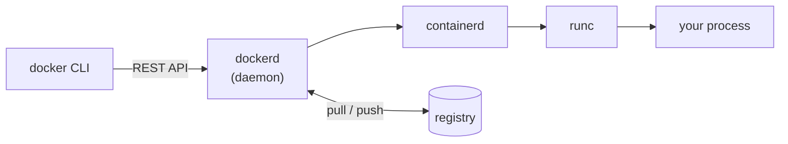
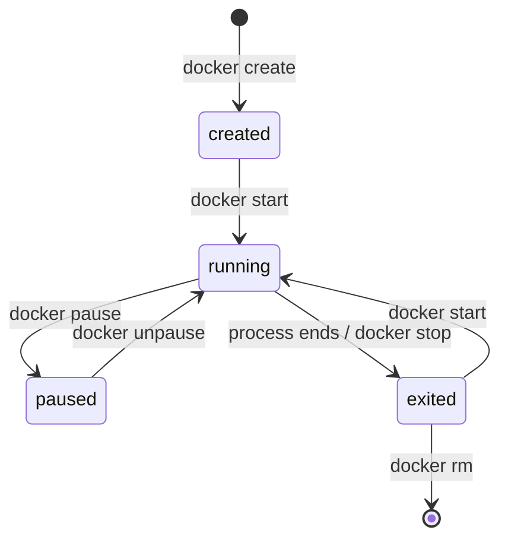
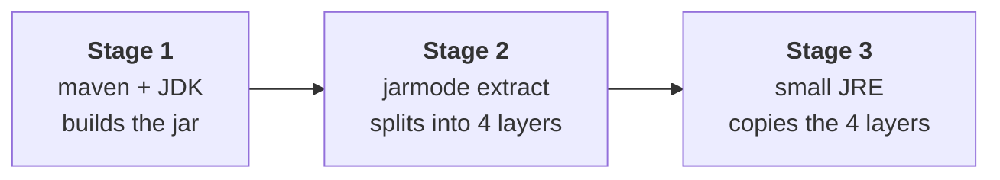

<div align="center">

# 🐳 Docker, before the interview

**A revision note for Java / Spring Boot developers**

The things you are most likely to be asked, in the order that is worth revising.
Docker basics first, then the Spring Boot part — that is what separates you
from someone who only read the docs.

`Last updated: 30 Aug 2026` · [PDF](exports/docker-interview-notes.pdf) · [HTML](exports/docker-interview-notes.html)

</div>

---

> [!TIP]
> **Only have 15 minutes?** Read [§1 Basics](#1-the-basic-idea) → [§5 Dockerfile](#5-dockerfile-rules) → [§7 Spring Boot](#7-spring-boot-and-docker) → [§11 Exit codes](#11-exit-codes-and-debugging) → [§16 Q&A](#16-questions-and-answers).
> The ⭐ rows below are the ones that come up most often.

## Table of contents

| # | Section | What is inside |
|:--:|---|---|
| ⭐ 1 | [The basic idea](#1-the-basic-idea) | Image, container, volume, registry. Container vs VM. |
| 2 | [How the pieces fit](#2-how-the-pieces-fit) | CLI, dockerd, containerd, runc, OCI, BuildKit |
| 3 | [Container lifecycle](#3-container-lifecycle) | created → running → exited, PID 1, SIGTERM |
| ⭐ 4 | [Commands one by one](#4-commands-one-by-one) | Every command explained + a full hands-on setup |
| ⭐ 5 | [Dockerfile rules](#5-dockerfile-rules) | Instructions, CMD vs ENTRYPOINT, layer cache |
| 6 | [Images size and tags](#6-images-size-and-tags) | Multi-stage, base images, `latest`, dangling images |
| ⭐ 7 | [Spring Boot and Docker](#7-spring-boot-and-docker) | Layered jars, buildpacks, JVM memory, shutdown, health |
| 8 | [Data and storage](#8-data-and-storage) | Volumes, bind mounts, tmpfs, copy-on-write |
| 8 | [Networking](#9-networking) | Bridge, host, overlay, DNS by container name |
| 10 | [Docker Compose](#10-docker-compose) | A full app + DB file, `depends_on`, healthchecks |
| ⭐ 11 | [Exit codes and debugging](#11-exit-codes-and-debugging) | 137, 143, 127, restart policies, logs |
| 12 | [Security checklist](#12-security-checklist) | Non-root, secrets, scanning, capabilities |
| 13 | [CI/CD and registry](#13-cicd-and-registry) | Tagging, pipeline shape, multi-arch builds |
| 14 | [Docker vs Kubernetes](#14-docker-vs-kubernetes) | One paragraph, enough for the question |
| ⭐ 15 | [Mistakes people make](#15-mistakes-people-make) | 12 things candidates get wrong |
| ⭐ 16 | [Questions and answers](#16-questions-and-answers) | 25 questions, answers hidden until you click |
| 17 | [Debugging playbook](#17-debugging-playbook) | 7 scenario questions and how to work through them |
| 18 | [Practice tasks](#18-practice-tasks) | 6 things to actually run |

---

## 1. The basic idea

**Why Docker exists:** to stop *"it works on my machine"*. Your JAR needs a certain JDK, some OS libraries, env vars, and a database on some port. Docker puts the app *and* everything it needs into one package that runs the same on your Mac, in CI, and in prod.

| Word | What it means |
|---|---|
| **Image** | A read-only template. Layers + settings (env, entrypoint, ports). Like a *class*. |
| **Container** | A running copy of an image = image layers + one thin **writable layer** + an isolated process. Like an *object*. |
| **Dockerfile** | The recipe used to build an image. Each line ≈ one layer. |
| **Registry** | Where images are stored — Docker Hub, ECR, GCR, Nexus, Harbor. |
| **Volume** | Storage managed by Docker that stays alive after the container is gone. |
| **Docker Compose** | A YAML file to run many containers together (app + MySQL + Redis) with one command. |

### Container vs VM

Asked in almost every interview.

| | Virtual machine | Container |
|---|---|---|
| Kernel | **Its own kernel** + full OS | **Shares the host kernel** |
| Size | Gigabytes | Megabytes |
| Start time | Minutes | Milliseconds |
| Isolation | Very strong (hypervisor) | Weaker — one shared kernel |
| Isolated by | Virtual hardware | **namespaces** (pid, net, mnt, uts, ipc, user), **cgroups** (CPU/memory limits), **union filesystem** (overlay2) |

> [!NOTE]
> On Mac and Windows there *is* a small Linux VM underneath, because containers are a Linux kernel feature.

<sub>[⬆ back to top](#table-of-contents)</sub>

---

## 2. How the pieces fit



| Piece | What it does |
|---|---|
| **dockerd** | The daemon. Builds images and manages containers, networks and volumes. Runs as root by default, which is why *rootless mode* exists. |
| **containerd** | Manages the container lifecycle. Kubernetes talks to this directly. |
| **runc** | Creates the namespaces and cgroups and starts the process. |
| **OCI** | The common standard for image format and runtime. This is why Kubernetes can run Docker-built images without Docker. |
| **BuildKit** | The new build engine, now the default. Parallel stages, cache mounts, secret mounts. |

<sub>[⬆ back to top](#table-of-contents)</sub>

---

## 3. Container lifecycle



- `docker run` = pull the image if it is missing, create the container (writable layer and network), then start it. Your process becomes **PID 1**.
- A container runs only as long as its **PID 1 process** runs. When the process ends, the container ends. There is no "background".
- `docker stop` sends **SIGTERM**, waits **10 seconds** (`-t`), then sends SIGKILL. `docker kill` sends SIGKILL right away.

<sub>[⬆ back to top](#table-of-contents)</sub>

---

## 4. Commands one by one

### 4.1 Images

| Command | What it does |
|---|---|
| `docker build -t myapp:1.0 .` | Builds an image using the Dockerfile in the current folder (`.`). `-t` gives it a name and tag. |
| `docker images` | Lists the images on your machine, with size. |
| `docker pull postgres:16` | Downloads an image from the registry without running it. |
| `docker history myapp:1.0` | Shows every layer of the image and its size. Use it to find the big one. |
| `docker tag myapp:1.0 myrepo/myapp:1.0` | Gives the same image a second name, usually the registry name, before pushing. |
| `docker push myrepo/myapp:1.0` | Uploads the image to the registry. |
| `docker rmi myapp:1.0` | Deletes an image from your machine. |

### 4.2 Containers

| Command | What it does |
|---|---|
| `docker run -d --name app -p 8080:8080 myapp:1.0` | Creates and starts a container. `-d` = background, `--name` = give it a name, `-p host:container` = open the port. |
| `docker run -e KEY=value ...` | Passes an environment variable into the container. |
| `docker ps` | Lists **running** containers. |
| `docker ps -a` | Lists **all** containers, including stopped ones and their exit code. |
| `docker logs app` | Prints what the app wrote to the console. |
| `docker logs -f --tail 100 app` | Last 100 lines, then keeps following new ones (like `tail -f`). |
| `docker exec -it app sh` | Opens a shell **inside** a running container. The normal way to look around. `-it` = interactive terminal. |
| `docker inspect app` | All details as JSON: env vars, mounts, network, exit code, whether it was OOM-killed. |
| `docker stop app` | Stops it politely (SIGTERM, then waits 10 seconds). |
| `docker start app` | Starts a stopped container again. |
| `docker restart app` | Stop + start. |
| `docker rm app` | Deletes a stopped container. `docker rm -f app` forces it while running. |

### 4.3 Volumes

| Command | What it does |
|---|---|
| `docker volume create pgdata` | Makes a named volume — a folder managed by Docker. |
| `docker volume ls` | Lists volumes. |
| `docker volume inspect pgdata` | Shows where it is stored and which containers use it. |
| `docker volume rm pgdata` | Deletes the volume **and the data inside it**. |

### 4.4 Networks

| Command | What it does |
|---|---|
| `docker network create app-net` | Makes a user-defined network. Containers on it find each other **by name**. |
| `docker network ls` | Lists networks. |
| `docker network inspect app-net` | Shows which containers are connected and their IPs. |
| `docker network connect app-net app` | Adds an already-running container to a network. |

### 4.5 Compose

| Command | What it does |
|---|---|
| `docker compose up -d` | Starts everything in `compose.yaml` in the background. |
| `docker compose up -d --build` | Same, but rebuilds the images first. |
| `docker compose ps` | Shows the services and their state. |
| `docker compose logs -f app` | Follows the logs of one service. |
| `docker compose down` | Stops and removes the containers and the network. Volumes stay. |
| `docker compose down -v` | Same, but **also deletes the named volumes** — your DB data is gone. |

### 4.6 Cleanup

| Command | What it does |
|---|---|
| `docker image prune` | Removes dangling (untagged) images. |
| `docker container prune` | Removes all stopped containers. |
| `docker system df` | Shows how much disk images, containers and volumes are using. |
| `docker system prune -a` | Removes everything unused. Be careful. |

### 4.7 Step by step setup

Build an app, a database, a network and a volume — the whole thing, in order.

<details>
<summary><b>Step 1 — build your image</b></summary>

```bash
cd my-spring-boot-app        # folder with the Dockerfile
docker build -t myapp:1.0 .
docker images                # you should see myapp:1.0
```

</details>

<details>
<summary><b>Step 2 — create a network</b> so the app and database find each other by name</summary>

```bash
docker network create app-net
```

</details>

<details>
<summary><b>Step 3 — create a volume</b> so the data survives when the container is deleted</summary>

```bash
docker volume create pgdata
```

</details>

<details>
<summary><b>Step 4 — start Postgres</b> on that network, with that volume</summary>

```bash
docker run -d --name postgres \
  --network app-net \
  -e POSTGRES_USER=appuser \
  -e POSTGRES_PASSWORD=secret \
  -e POSTGRES_DB=appdb \
  -v pgdata:/var/lib/postgresql/data \
  -p 5432:5432 \
  postgres:16
```

- `-v pgdata:/var/lib/postgresql/data` — Postgres stores its files in that path, so we point the volume there.
- `-p 5432:5432` — only needed if you also want to connect from your Mac (DBeaver, IntelliJ). Containers on `app-net` do not need it.

</details>

<details>
<summary><b>Step 5 — check it is ready</b></summary>

```bash
docker ps                                   # is it running?
docker logs postgres                        # look for "database system is ready"
docker exec -it postgres pg_isready -U appuser
```

</details>

<details>
<summary><b>Step 6 — start your app on the same network</b></summary>

```bash
docker run -d --name app \
  --network app-net \
  -p 8080:8080 \
  -e SPRING_DATASOURCE_URL=jdbc:postgresql://postgres:5432/appdb \
  -e SPRING_DATASOURCE_USERNAME=appuser \
  -e SPRING_DATASOURCE_PASSWORD=secret \
  myapp:1.0

docker logs -f app
```

> [!IMPORTANT]
> The URL uses `postgres` — the **container name** — and port **5432**, the port *inside* the network. Not `localhost`.

</details>

<details>
<summary><b>Step 7 — prove the volume works</b></summary>

```bash
docker rm -f postgres        # delete the database container
docker run -d --name postgres --network app-net \
  -e POSTGRES_USER=appuser -e POSTGRES_PASSWORD=secret -e POSTGRES_DB=appdb \
  -v pgdata:/var/lib/postgresql/data postgres:16
```

Your tables and rows are still there, because they live in the volume, not in the container.

</details>

<details>
<summary><b>Step 8 — clean up when you are done</b></summary>

```bash
docker rm -f app postgres
docker network rm app-net
docker volume rm pgdata      # this deletes the data
```

</details>

### 4.8 Looking inside Postgres

Open a psql session inside the container:

```bash
docker exec -it postgres psql -U appuser -d appdb
```

psql commands start with a backslash; SQL ends with a semicolon.

| Command | What it does |
|---|---|
| `\l` | List all databases |
| `\c appdb` | Switch to the `appdb` database |
| `\dt` | **List the tables** |
| `\d users` | Show columns, types and indexes of the `users` table |
| `\dn` | List schemas |
| `\du` | List users / roles |
| `SELECT * FROM users LIMIT 10;` | Read some rows |
| `SELECT count(*) FROM users;` | Count rows |
| `\x` | Toggle wide output — helpful when a row has many columns |
| `\q` | Quit |

Run one command without opening a session:

```bash
docker exec -it postgres psql -U appuser -d appdb -c "\dt"
docker exec -it postgres psql -U appuser -d appdb -c "SELECT * FROM users LIMIT 5;"
```

> [!TIP]
> "Did not find any relations" usually means you are in the wrong database or schema. Check with `\c appdb` and then `\dt public.*`.

### 4.9 The same thing in MySQL

<details>
<summary><b>Show the MySQL version</b></summary>

```bash
docker run -d --name mysql --network app-net \
  -e MYSQL_ROOT_PASSWORD=secret -e MYSQL_DATABASE=appdb \
  -v mysqldata:/var/lib/mysql -p 3306:3306 mysql:8

docker exec -it mysql mysql -uroot -psecret appdb
```

| Command | What it does |
|---|---|
| `SHOW DATABASES;` | List databases |
| `USE appdb;` | Switch database |
| `SHOW TABLES;` | **List the tables** |
| `DESCRIBE users;` | Show the columns of a table |
| `SELECT * FROM users LIMIT 10;` | Read some rows |
| `exit` | Quit |

</details>

> [!WARNING]
> Passwords typed on the command line are fine for local practice, but not for real environments — see [§12](#12-security-checklist).

<sub>[⬆ back to top](#table-of-contents)</sub>

---

## 5. Dockerfile rules

```dockerfile
FROM eclipse-temurin:21-jre-alpine
WORKDIR /app
ARG JAR_FILE=target/*.jar           # build time only
ENV SPRING_PROFILES_ACTIVE=prod     # saved inside the image -> no secrets here!
COPY ${JAR_FILE} app.jar
RUN addgroup -S app && adduser -S app -G app
USER app                            # stop running as root
EXPOSE 8080                         # only documentation
HEALTHCHECK --interval=30s --timeout=3s --start-period=40s --retries=3 \
  CMD wget -qO- http://localhost:8080/actuator/health || exit 1
ENTRYPOINT ["java","-jar","/app/app.jar"]
CMD ["--server.port=8080"]          # default arguments, can be replaced
```

### Differences you will be asked about

| Pair | Answer |
|---|---|
| `RUN` vs `CMD` vs `ENTRYPOINT` | RUN runs while building and makes a layer. ENTRYPOINT is the command that runs. CMD gives default arguments — anything you type after `docker run` replaces them. |
| **exec form** vs **shell form** | Exec form `["java","-jar","x.jar"]`: java is PID 1 and gets SIGTERM, so shutdown is clean. Shell form `java -jar x.jar` runs inside `/bin/sh -c`, so `sh` is PID 1 and eats the signal — `docker stop` then waits 10s and kills it. **Always use exec form for Spring Boot.** |
| `COPY` vs `ADD` | COPY only copies files. ADD can also download URLs and unpack tar files. Use COPY — simpler and predictable. |
| `EXPOSE` vs `-p 8080:8080` | EXPOSE is just information. `-p host:container` really opens the port. `-P` opens all EXPOSEd ports on random host ports. |
| `ARG` vs `ENV` | ARG works only during the build (`--build-arg`). ENV stays in the image and is visible in `docker inspect` and image history — keep secrets out of both. |

### Layer cache

The most common build question.

- Every line makes a layer. Docker caches it using the line plus a hash of the files it copies.
- If one layer changes, **every layer after it is rebuilt**.
- So put the things that rarely change first: copy `pom.xml`, run `mvn dependency:go-offline`, and copy `src/` **after** that. Otherwise every code change downloads all dependencies again.
- `.dockerignore` makes the **build context** smaller (Docker sends everything in `.` to the daemon). Ignore `.git`, IDE files, `node_modules`.

> [!WARNING]
> Deleting a file in a later layer does **not** make the image smaller — the file is still inside the earlier layer and can be pulled out. Install and clean up in the **same** `RUN`.
> Also, if your Dockerfile does `COPY target/*.jar`, don't put `target/` in `.dockerignore`.

<sub>[⬆ back to top](#table-of-contents)</sub>

---

## 6. Images size and tags

- **Multi-stage build** — use the full JDK and Maven in stage 1, then `COPY --from=builder` only the JAR into a small JRE stage. Build tools, source code and the Maven cache never reach the final image. A Spring Boot image usually drops from ~800 MB to ~200 MB on a JRE base, and under 100 MB with alpine/jlink.
- **Base image options:** `21-jdk` (big) → `21-jre` → `21-jre-alpine` (musl libc — watch native libraries and DNS issues) → distroless (no shell, smallest attack surface, hardest to debug).
- **Tags can move; digests cannot.** `latest` is only a default tag name, not "the newest". It makes builds hard to repeat and rollbacks hard. In prod use `myapp:1.4.2` or `myapp@sha256:...`.
- A **dangling image** is the old untagged layer set left behind when you rebuild the same tag (`<none>:<none>`). Clean with `docker image prune`.

<sub>[⬆ back to top](#table-of-contents)</sub>

---

## 7. Spring Boot and Docker

> [!IMPORTANT]
> Most of your questions will be here. Learn to tell the whole story:
> **fat jar → layered jar → multi-stage build → buildpacks → JVM memory.**

### 7.1 The problem with the fat JAR

A Spring Boot uber-jar is about 50 MB, and about 48 MB of it is dependencies that almost never change. `COPY app.jar` makes **one huge layer**, so even a one-line code change pushes and pulls the full 50 MB.

### 7.2 Layered JARs

Spring Boot 2.3+ writes a `layers.idx` file that splits the JAR into 4 layers, from "rarely changes" to "changes every time":

| # | Layer | Changes |
|:--:|---|---|
| 1 | `dependencies` | Almost never |
| 2 | `spring-boot-loader` | Almost never |
| 3 | `snapshot-dependencies` | Sometimes |
| 4 | `application` | **Every deploy** — your code and resources |

So a redeploy sends **KB instead of MB**, and image pulls become very fast.

```bash
java -Djarmode=tools -jar app.jar list-layers      # Boot 3.3+
java -Djarmode=layertools -jar app.jar list        # Boot 2.3 - 3.2
```

### 7.3 The Dockerfile to remember



```dockerfile
# ---------- stage 1: build ----------
FROM maven:3.9-eclipse-temurin-21 AS build
WORKDIR /src
COPY pom.xml .
RUN mvn -B dependency:go-offline        # cached until pom.xml changes
COPY src ./src
RUN mvn -B clean package -DskipTests

# ---------- stage 2: split into layers ----------
FROM eclipse-temurin:21-jre AS extractor
WORKDIR /app
COPY --from=build /src/target/*.jar app.jar
RUN java -Djarmode=tools -jar app.jar extract --layers --destination extracted
# Boot 2.3-3.2:  java -Djarmode=layertools -jar app.jar extract

# ---------- stage 3: run ----------
FROM eclipse-temurin:21-jre
WORKDIR /app
RUN useradd -r -u 1001 spring
COPY --from=extractor /app/extracted/dependencies/ ./
COPY --from=extractor /app/extracted/spring-boot-loader/ ./
COPY --from=extractor /app/extracted/snapshot-dependencies/ ./
COPY --from=extractor /app/extracted/application/ ./
USER 1001
EXPOSE 8080
ENTRYPOINT ["java","-XX:MaxRAMPercentage=75.0","-jar","application.jar"]
```

The `application.jar` in the last stage is the small launcher created by the extract step, not the uber-jar.

To make the Maven step faster without adding a layer, use a BuildKit cache mount:

```dockerfile
RUN --mount=type=cache,target=/root/.m2 mvn -B clean package -DskipTests
```

### 7.4 Buildpacks

No Dockerfile at all.

```bash
mvn spring-boot:build-image -Dspring-boot.build-image.imageName=myorg/myapp:1.0
./gradlew bootBuildImage
```

Uses **Cloud Native Buildpacks (Paketo)** and needs Docker running. You get a good JRE, layers, container-aware JVM memory settings and a non-root user for free.

| Use buildpacks when | Use a Dockerfile when |
|---|---|
| You don't want to maintain Dockerfiles across many services | You need extra OS packages |
| You want standard images everywhere | You must use a company base image |
| You want sane defaults without thinking | You need full control |

### 7.5 The JVM inside a container

Common senior question.

- Since **JDK 10**, `-XX:+UseContainerSupport` is on by default, so the JVM reads the *container* limits, not the host's. On Java 8 before 8u191 the JVM saw the **host's** RAM and CPU and got killed — the classic story.
- By default max heap is only **25%** of container memory (`MaxRAMPercentage`). Set `-XX:MaxRAMPercentage=75.0` instead of a fixed `-Xmx` that ignores the limit.
- **Heap is not the same as container memory.** Metaspace, thread stacks, code cache, direct/NIO buffers and GC data sit outside the heap. Give the container about heap + 25–35%.
- `-XX:ActiveProcessorCount` matters when CPU limits are fractional — it decides GC threads, `ForkJoinPool.commonPool`, and Tomcat/Netty defaults.
- Tools: `docker stats`, `jcmd <pid> VM.native_memory`, Actuator `/actuator/metrics/jvm.memory.used`.

> [!CAUTION]
> Getting this wrong is the usual reason for **exit code 137**. If someone asks *"why does my pod keep restarting under load?"*, this is the answer they want.

### 7.6 Config and profiles

- Spring converts env vars to properties: `SPRING_DATASOURCE_URL` → `spring.datasource.url`, `SPRING_PROFILES_ACTIVE=prod`.
- Order, highest wins: command-line args → env vars / `SPRING_APPLICATION_JSON` → `application-prod.yml` → `application.yml`.
- Never put prod passwords in the image — `ENV` and `ARG` can be read with `docker history`. Pass them at runtime with `-e`, `--env-file`, Docker/K8s secrets, Vault, or AWS Secrets Manager.
- The **same image** should move from dev to stage to prod. Only the env vars change.

### 7.7 Graceful shutdown

```properties
server.shutdown=graceful
spring.lifecycle.timeout-per-shutdown-phase=30s
```

And use the exec-form ENTRYPOINT so the JVM is PID 1 and really gets SIGTERM. If you start child processes, run with `--init` so signals are passed on and zombie processes are cleaned up.

### 7.8 Health checks

```properties
management.endpoint.health.probes.enabled=true   # /actuator/health/liveness & /readiness
management.endpoints.web.exposure.include=health,info,metrics,prometheus
```

> [!WARNING]
> A Docker **restart policy does not look at the healthcheck**. An unhealthy container keeps running; only the process exiting causes a restart. Kubernetes *does* restart on a failed liveness probe, and Swarm reschedules.
> Also `curl` is often missing in slim images — use `wget -qO-`.

### 7.9 Nice things to mention

- **`spring-boot-docker-compose`** (Boot 3.1+) — during development the app starts your `compose.yaml` itself and connects the datasource with `@ServiceConnection`.
- **Testcontainers** — start a real MySQL or Kafka in JUnit; `@ServiceConnection` fills in the properties. Use this to answer *"how do you test against a real database in CI?"*

<sub>[⬆ back to top](#table-of-contents)</sub>

---

## 8. Data and storage

| Type | What it is | Use it for |
|---|---|---|
| **Named volume** | A folder managed by Docker; survives `docker rm` | DB data, uploads, anything in prod |
| **Bind mount** | A specific folder on your host | Dev hot-reload, config files, certs, logs |
| **tmpfs** | Only in RAM, gone on stop | Temporary data or secrets that must not touch disk |
| **Writable layer** | The default; deleted with the container | Nothing important |

```bash
docker run -v pgdata:/var/lib/postgresql/data postgres:16   # named volume
docker run -v "$PWD/config":/app/config:ro myapp            # bind mount, read-only
```

- **Copy-on-write:** reads come from the image layer, but the first write copies the file into the container layer. So writing a lot to the container filesystem is slow *and* the data is lost later.
- Containers should be **stateless**. Keep state in a volume or an external service. That is what makes them easy to replace and scale.
- To share data between containers, mount the same named volume — or better, talk over the network.

<sub>[⬆ back to top](#table-of-contents)</sub>

---

## 9. Networking

| Driver | What it does |
|---|---|
| **bridge** (default) | Private network on one host. Containers get private IPs; you need `-p` to reach them from the host. |
| **user-defined bridge** | Same, plus **built-in DNS** — containers reach each other **by name**. Always prefer this. |
| **host** | No separate network. Uses the host network directly: no `-p`, fastest, no isolation. Linux only. |
| **none** | No network. |
| **overlay** | Across many hosts (Swarm). |
| **macvlan** | The container gets a real MAC/IP on your physical network. |

> [!WARNING]
> The **default** bridge has **no DNS**. That is the classic *"my app cannot find `mysql`"* bug. Compose creates a user-defined network for you, so service names work: `jdbc:mysql://mysql:3306/appdb`.

- Inside the network, use the **container port** (3306), not the published host port.
- `localhost` inside a container means that container. To reach something on your Mac, use `host.docker.internal`.
- `-p 8080:8081` means hostPort:containerPort. If the host port is taken you get "port is already allocated".

<sub>[⬆ back to top](#table-of-contents)</sub>

---

## 10. Docker Compose

```yaml
services:
  mysql:
    image: mysql:8
    environment:
      MYSQL_ROOT_PASSWORD: ${DB_PASSWORD}
      MYSQL_DATABASE: appdb
    volumes: [ mysqldata:/var/lib/mysql ]
    healthcheck:
      test: ["CMD", "mysqladmin", "ping", "-h", "localhost"]
      interval: 10s
      timeout: 5s
      retries: 10

  app:
    build: .
    ports: ["8080:8080"]
    environment:
      SPRING_PROFILES_ACTIVE: docker
      SPRING_DATASOURCE_URL: jdbc:mysql://mysql:3306/appdb
      SPRING_DATASOURCE_USERNAME: root
      SPRING_DATASOURCE_PASSWORD: ${DB_PASSWORD}
    depends_on:
      mysql:
        condition: service_healthy   # waits until HEALTHY, not just "started"
    restart: unless-stopped

volumes:
  mysqldata:
```

- Compose runs many containers on **one machine**. A **Dockerfile builds one image**; Compose **runs many containers** and connects them with network, volumes and env vars.
- Plain `depends_on: [mysql]` only controls **start order**. It does not wait until MySQL is ready — that is why the app crashes on startup. Fix with `condition: service_healthy`, and also add retry in the app, because a good service should not depend on start order.
- The `version:` line at the top is no longer used in Compose v2. The command is `docker compose`; `docker-compose` v1 is dead.
- Also worth knowing: `--profile debug`, `up --scale worker=3`, an `.env` file for `${VAR}`, and `docker compose config` to see the final file.

<sub>[⬆ back to top](#table-of-contents)</sub>

---

## 11. Exit codes and debugging

| Code | Meaning |
|:--:|---|
| `0` | Exited normally |
| `1` | Application error / uncaught exception |
| `125` | The Docker daemon failed — usually a wrong flag |
| `126` | Command found but not executable |
| `127` | Command not found — a typo, or no shell in a slim/distroless image |
| **`137`** | **128+9 SIGKILL** — almost always the OOM killer. Check `docker inspect --format '{{.State.OOMKilled}}'`. Can also mean a stop that timed out. |
| `139` | 128+11 SIGSEGV — often a native library or wrong CPU architecture |
| `143` | 128+15 SIGTERM — a normal `docker stop` |

- **Limits:** `--memory=1g --memory-swap=1g --cpus=1.5`. With no limits, one container can eat the whole host.
- **Restart policies:** `no` (default), `on-failure[:5]`, `always`, `unless-stopped`. They react to the *process exiting*, not to "unhealthy".
- **`exec` vs `attach`:** exec starts a new process (safe for debugging). attach connects to PID 1's input/output, where Ctrl-C can kill the container.
- **Logs:** Docker collects stdout/stderr of PID 1. So log to the console, never to a file inside the container. Logging drivers (`json-file`, `local`, `awslogs`, `fluentd`, `gelf`) send them elsewhere. Always set `max-size`/`max-file` on `json-file` or the disk fills up.

<sub>[⬆ back to top](#table-of-contents)</sub>

---

## 12. Security checklist

- [ ] Run as **non-root** — use `USER` or `--user 1001`. The default is UID 0 (root).
- [ ] Use a small, pinned base image. Rebuild often for security patches.
- [ ] Scan images with `docker scout cves`, Trivy or Snyk.
- [ ] **No secrets in the image** — not in `ENV`, `ARG`, or a copied `application-prod.yml`. They stay in the layers and in `docker history`. Pass them at runtime, or use a BuildKit `--mount=type=secret`.
- [ ] `--read-only` root filesystem plus a tmpfs for `/tmp`.
- [ ] `--cap-drop ALL --cap-add NET_BIND_SERVICE` and `--security-opt no-new-privileges`.
- [ ] Never mount `/var/run/docker.sock` into a container you don't trust — that gives root on the host.
- [ ] Use rootless Docker on shared machines, sign images, and keep internal ones in a private registry.

<sub>[⬆ back to top](#table-of-contents)</sub>

---

## 13. CI/CD and registry

- Tag images with the **git SHA** — `myapp:1.4.2`, `myapp:sha-a1b2c3d`. Then you know exactly what is running and can roll back. Use `latest` only as a shortcut.
- Pipeline: `build → unit tests → build image → scan → push to registry → deploy by digest`.
- Speed up CI with `--cache-from` or the BuildKit registry cache, and cache `.m2` with a cache mount.

> [!WARNING]
> **Common on Mac:** an M-series Mac builds `linux/arm64`, but most servers are `linux/amd64` → you get `exec format error`.
> Fix: `docker buildx build --platform linux/amd64,linux/arm64 --push`

<sub>[⬆ back to top](#table-of-contents)</sub>

---

## 14. Docker vs Kubernetes

Docker builds and runs containers on **one machine**. Kubernetes runs them across **many machines**: scheduling, restarting failed pods, scaling, service discovery, rolling deploys, config and secrets. Compose is for dev and one host; Kubernetes is for production at scale. Kubernetes removed the Docker runtime shim (dockershim) but still runs Docker-built **OCI** images through containerd. Docker Swarm is Docker's own simpler orchestrator, mostly old now.

<sub>[⬆ back to top](#table-of-contents)</sub>

---

## 15. Mistakes people make

| # | The mistake | The truth |
|:--:|---|---|
| 1 | "Containers are small VMs" | They are isolated processes sharing the host kernel |
| 2 | `EXPOSE` opens a port | It is documentation only; `-p` opens it |
| 3 | Deleting a file in a later layer shrinks the image | The bytes stay in the earlier layer |
| 4 | `latest` means newest | It is just a tag name |
| 5 | `depends_on` waits for the DB | It only controls start order |
| 6 | Restart policies react to healthchecks | They react to the process exiting |
| 7 | Shell-form ENTRYPOINT is fine | It breaks SIGTERM and graceful shutdown |
| 8 | Heap size = container memory | Heap is a part of it — this is exit 137 |
| 9 | Containers always resolve each other by name | Not on the **default** bridge |
| 10 | `docker rm` is harmless | Without a volume, the database is gone |
| 11 | Secrets in `ENV` are private | Anyone who pulls the image can read them |
| 12 | An image built on a Mac runs anywhere | arm64 vs amd64 — use buildx |

<sub>[⬆ back to top](#table-of-contents)</sub>

---

## 16. Questions and answers

Try to answer out loud before you open each one.

### Basics

<details>
<summary><b>What is Docker and why use it?</b></summary>

It packages the app with everything it needs into one image, so it behaves the same everywhere, starts fast, and uses fewer resources than VMs.

</details>

<details>
<summary><b>Image vs container?</b></summary>

A read-only template versus a running copy of it with a writable layer. Class versus object.

</details>

<details>
<summary><b>Container vs VM?</b></summary>

Shared kernel with namespaces and cgroups versus its own kernel. MB and milliseconds versus GB and minutes. Weaker versus stronger isolation.

</details>

<details>
<summary><b>What happens on <code>docker run</code>?</b></summary>

Pull the image if it is missing, create the container with a writable layer and network, then start the entrypoint as PID 1.

</details>

<details>
<summary><b>Describe Docker's architecture.</b></summary>

CLI → dockerd over a REST API → containerd → runc, plus a registry for images.

</details>

### Images and Dockerfile

<details>
<summary><b>What is a layer?</b></summary>

A read-only set of file changes made by one Dockerfile line. Layers are cached and shared between images.

</details>

<details>
<summary><b>How do you make builds faster?</b></summary>

Put rarely-changing lines first, copy `pom.xml` and download dependencies before `src`, use `.dockerignore`, BuildKit cache mounts and multi-stage builds.

</details>

<details>
<summary><b>How do you make the image smaller?</b></summary>

Multi-stage build, a JRE or distroless base instead of a JDK, install and clean up in one RUN, and a `.dockerignore`. Find the big layer with `docker history`.

</details>

<details>
<summary><b>CMD vs ENTRYPOINT?</b></summary>

ENTRYPOINT is the command, CMD is the default arguments. Args after `docker run` replace CMD; `--entrypoint` replaces ENTRYPOINT.

</details>

<details>
<summary><b>What is a dangling image?</b></summary>

Old untagged `<none>` layers left after rebuilding a tag. Remove them with `docker image prune`.

</details>

### Storage and networking

<details>
<summary><b>Volume vs bind mount?</b></summary>

A folder managed by Docker (portable, easy to back up) versus a specific host path. Volumes for DB data, bind mounts for dev and config.

</details>

<details>
<summary><b>How do two containers talk to each other?</b></summary>

On the same user-defined network, using the service or container name (Docker's built-in DNS) and the container port.

</details>

<details>
<summary><b>Bridge vs host vs overlay?</b></summary>

Private network on one host / share the host's network / span many hosts.

</details>

### Compose

<details>
<summary><b>Compose vs Dockerfile?</b></summary>

A Dockerfile builds one image; Compose runs and connects many containers.

</details>

<details>
<summary><b>The app starts before the DB is ready — how do you fix it?</b></summary>

Add a `healthcheck` on the DB and `depends_on: condition: service_healthy`, and add retry in the app (HikariCP `initializationFailTimeout`, Flyway retries).

</details>

### Spring Boot

<details>
<summary><b>How do you dockerize a Spring Boot app?</b></summary>

Multi-stage build: Maven builds the JAR, `jarmode=tools extract --layers` splits it, copy the 4 layers into a small JRE image, run as non-root, use exec-form ENTRYPOINT, and pass config through env vars. Or use `mvn spring-boot:build-image` and skip the Dockerfile.

</details>

<details>
<summary><b>Why layered jars?</b></summary>

Dependencies rarely change and your code changes often, so only the small `application` layer is rebuilt, pushed and pulled.

</details>

<details>
<summary><b>How do you set JVM memory in a container?</b></summary>

`UseContainerSupport` (on by default since JDK 10) reads the container limits. Set `MaxRAMPercentage=75` and leave room for metaspace, threads and direct buffers, or you get exit 137.

</details>

<details>
<summary><b>How do you handle profiles and config?</b></summary>

`SPRING_PROFILES_ACTIVE` and env vars: one image, different config per environment, and secrets passed at runtime.

</details>

<details>
<summary><b>How do you get a clean shutdown?</b></summary>

`server.shutdown=graceful` plus exec-form ENTRYPOINT, so the JVM is PID 1 and gets SIGTERM within the 10 second window.

</details>

<details>
<summary><b>How do you expose health?</b></summary>

Actuator liveness and readiness endpoints, a Docker `HEALTHCHECK`, and in Kubernetes the liveness, readiness and startup probes.

</details>

<details>
<summary><b>How do you test against a real database?</b></summary>

Testcontainers with `@ServiceConnection`, and `spring-boot-docker-compose` for local development.

</details>

### Security

<details>
<summary><b>How do you secure a container?</b></summary>

Non-root user, small pinned base image, regular scanning, no secrets in the image, read-only filesystem, dropped capabilities, never mount the Docker socket, and a rootless daemon.

</details>

<details>
<summary><b>How do you handle secrets?</b></summary>

Only at runtime: env from a secret manager, Docker or Kubernetes secrets, Vault, or BuildKit secret mounts. Never inside a layer.

</details>

<sub>[⬆ back to top](#table-of-contents)</sub>

---

## 17. Debugging playbook

Scenario questions check whether you have a method. Say the steps out loud.

<details>
<summary><b>"The container exits immediately."</b></summary>

`docker ps -a` for the exit code → `docker logs` → `docker inspect`. Usual reasons: the app failed at startup (wrong datasource URL, missing env var), CMD was not a foreground process, a wrong path or entrypoint (127), or out of memory (137). Reproduce with `docker run -it --entrypoint sh image` and run the command by hand.

</details>

<details>
<summary><b>"It works locally but not in Docker."</b></summary>

Usually config, not code: `localhost` instead of the service name, a missing env var or profile, a port not published, a file path or permission the non-root user can't write, DNS on the default bridge, timezone or locale, or the wrong CPU architecture.

</details>

<details>
<summary><b>"It gets killed under load (137)."</b></summary>

`docker inspect --format '{{.State.OOMKilled}}'` — if true, raise `--memory` or lower `MaxRAMPercentage`. Look for a leak with `-XX:+HeapDumpOnOutOfMemoryError -XX:HeapDumpPath=/dump` writing to a mounted volume, plus Actuator metrics.

</details>

<details>
<summary><b>"<code>docker stop</code> always takes 10 seconds."</b></summary>

PID 1 is not getting or handling SIGTERM. Use exec form, add `--init`, and turn on graceful shutdown.

</details>

<details>
<summary><b>"My code change didn't appear after rebuild."</b></summary>

Either the layer cache is stale or you are running the old tag. Try `docker build --no-cache`, check the image ID, use `docker compose up --build`, and make sure `.dockerignore` is not excluding your source.

</details>

<details>
<summary><b>"The image is 1.2 GB."</b></summary>

`docker history` to find the big layer, then multi-stage build + JRE base + cleanup in the same RUN.

</details>

<details>
<summary><b>"The app can't reach MySQL."</b></summary>

Same network? (`docker network inspect`) Using the service name and the *container* port? Was the DB ready? Are the env vars correct? Then `docker exec -it app sh` and `nc -zv mysql 3306`.

</details>

<sub>[⬆ back to top](#table-of-contents)</sub>

---

## 18. Practice tasks

Do these once and you will have real examples instead of definitions.

- [ ] Dockerize one Spring Boot service two ways — your own multi-stage Dockerfile and `spring-boot:build-image`. Compare image size and rebuild time after a one-line change.
- [ ] Run `docker history` on your image, find the biggest layer, and remove it.
- [ ] Compose: app + MySQL + healthcheck with `depends_on`. Stop the DB container and see what the app does.
- [ ] Add a named volume and check the data survives `docker compose down` and disappears with `down -v`.
- [ ] Run with `--memory=512m` and default JVM settings, put load on it, get exit 137, then fix it with `MaxRAMPercentage`.
- [ ] Break things on purpose: shell-form ENTRYPOINT and time `docker stop`; default bridge and watch DNS fail.
- [ ] Try `docker buildx build --platform linux/amd64,linux/arm64`.

<sub>[⬆ back to top](#table-of-contents)</sub>

---

## Sources

- **Docker docs** — [Get started](https://docs.docker.com/get-started/) · [What is a container](https://docs.docker.com/get-started/docker-concepts/the-basics/what-is-a-container/) · [Dockerfile best practices](https://docs.docker.com/build/building/best-practices/)
- **Spring Boot reference** — [Container images / Dockerfiles](https://docs.spring.io/spring-boot/reference/packaging/container-images/dockerfiles.html)
- **Docker blog** — [9 tips for containerizing Spring Boot](https://www.docker.com/blog/9-tips-for-containerizing-your-spring-boot-code/)
- **Interview sets** — [KodeKloud](https://kodekloud.com/blog/docker-interview-questions/) · [Dataquest](https://www.dataquest.io/blog/docker-interview-questions-and-answers/) · [DataCamp](https://www.datacamp.com/blog/docker-interview-questions) · [Devinterview-io](https://github.com/Devinterview-io/docker-interview-questions)

<sub>[⬆ back to top](#table-of-contents)</sub>
