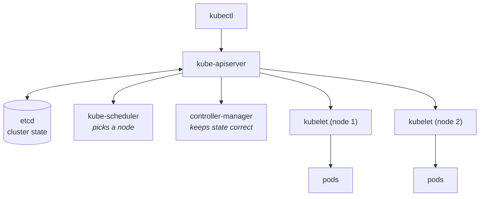
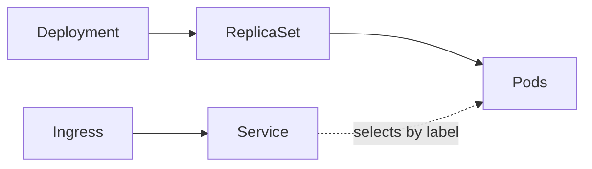

# ☸️ Kubernetes, before the interview

**A revision note for Java / Spring Boot developers**

Docker runs containers on **one machine**. Kubernetes runs them across **many** — and keeps them running. This note assumes you know Docker; if not, read [that one first](../docker/docker-interview-revision.md).

<sub>`Last updated: 30 Sep 2026`</sub>

---

> [!TIP]
> **Short on time?** Read [§3 Objects](#3-the-objects-you-must-know) → [§6 Spring Boot](#6-spring-boot-in-kubernetes) → [§10 Debugging](#10-debugging) → [§12 Q&A](#12-questions-and-answers).

| # | Section | What is inside |
|:--:|---|---|
| 1 | [Why Kubernetes](#1-why-kubernetes) | What it adds over Docker and Compose |
| 2 | [Architecture](#2-architecture) | Control plane and node components |
| ⭐ 3 | [The objects you must know](#3-the-objects-you-must-know) | Pod, Deployment, Service, ConfigMap, Secret |
| ⭐ 4 | [kubectl commands](#4-kubectl-commands) | Every command explained |
| ⭐ 5 | [Deploying a Spring Boot app](#5-deploying-a-spring-boot-app) | The full YAML, end to end |
| ⭐ 6 | [Spring Boot in Kubernetes](#6-spring-boot-in-kubernetes) | Probes, memory, shutdown, config |
| 7 | [Services and networking](#7-services-and-networking) | ClusterIP, NodePort, LoadBalancer, Ingress, DNS |
| 8 | [Storage](#8-storage) | PV, PVC, StatefulSet |
| 9 | [Rollouts and scaling](#9-rollouts-and-scaling) | Rolling updates, rollback, HPA |
| ⭐ 10 | [Debugging](#10-debugging) | CrashLoopBackOff, ImagePullBackOff, OOMKilled, Pending |
| ⭐ 11 | [Mistakes people make](#11-mistakes-people-make) | 10 things candidates get wrong |
| ⭐ 12 | [Questions and answers](#12-questions-and-answers) | 20 questions, answers hidden until you click |
| 13 | [Practice tasks](#13-practice-tasks) | Things to actually run |

---

## 1. Why Kubernetes

Docker Compose can run your app and a database together. It cannot:

| Problem | What Kubernetes does |
|---|---|
| A container dies at 3am | Restarts it automatically |
| One machine is not enough | Schedules pods across many machines |
| Traffic doubles | Scales replicas up, then back down |
| You deploy a bad build | Rolling update, and `rollout undo` to go back |
| A pod moves to another node | Service discovery follows it by name |
| Config differs per environment | ConfigMaps and Secrets, injected at runtime |

You describe the **desired state** in YAML. Kubernetes continuously works to make reality match it. That loop is the entire idea — everything else is detail.

## 2. Architecture



**Control plane** — the brain:

| Component | Job |
|---|---|
| **kube-apiserver** | The only way in. Everything talks to it, nothing talks to etcd directly. |
| **etcd** | Key-value store holding all cluster state. Back this up. |
| **kube-scheduler** | Decides which node a new pod goes on, based on resources and constraints |
| **controller-manager** | Runs the control loops: "3 replicas wanted, 2 running → start one" |

**Every worker node:**

| Component | Job |
|---|---|
| **kubelet** | Talks to the API server, starts and watches containers on that node |
| **kube-proxy** | Routes Service traffic to the right pods |
| **container runtime** | containerd — actually runs the containers |

> [!NOTE]
> Kubernetes removed the Docker runtime shim (dockershim) in 1.24, but still runs **Docker-built OCI images** through containerd. Your Dockerfile is unaffected.

## 3. The objects you must know

| Object | What it is |
|---|---|
| **Pod** | The smallest deployable unit. One or more containers that **share a network namespace and volumes**. Containers in a pod reach each other on `localhost`. |
| **ReplicaSet** | Keeps N identical pods running. You rarely write one directly. |
| **Deployment** | Manages ReplicaSets for you — rolling updates, rollback, scaling. **This is what you write for a stateless app.** |
| **Service** | A stable name and IP in front of a changing set of pods |
| **Ingress** | HTTP routing from outside the cluster — paths, hosts, TLS |
| **ConfigMap** | Non-secret config as key-value pairs |
| **Secret** | The same, for sensitive values (base64-encoded, *not* encrypted by default) |
| **Namespace** | A folder for grouping objects — `dev`, `staging`, `prod` |
| **StatefulSet** | For databases: stable names, ordered startup, its own disk per pod |
| **DaemonSet** | One pod on every node — log collectors, agents |
| **Job / CronJob** | Run once to completion / on a schedule |



> [!IMPORTANT]
> A Service finds its pods by **label selector**, not by name. If the labels do not match, the Service exists but sends traffic nowhere — and you get no error. This is the most common silent failure in Kubernetes.

## 4. kubectl commands

### Looking around

| Command | What it does |
|---|---|
| `kubectl get pods` | Lists pods in the current namespace |
| `kubectl get pods -o wide` | Same, plus node and pod IP |
| `kubectl get all` | Pods, services, deployments, replicasets together |
| `kubectl get pods -n prod` | In a specific namespace. `-A` = all namespaces |
| `kubectl describe pod my-app-xyz` | **Full detail plus recent events.** The first thing to run when something is wrong. |
| `kubectl get events --sort-by=.lastTimestamp` | What the cluster has been doing lately |

### Logs and shells

| Command | What it does |
|---|---|
| `kubectl logs my-app-xyz` | Logs from the pod |
| `kubectl logs -f --tail=100 my-app-xyz` | Follow the last 100 lines |
| `kubectl logs --previous my-app-xyz` | Logs from the **crashed** container — essential for CrashLoopBackOff |
| `kubectl exec -it my-app-xyz -- sh` | Shell inside the pod |
| `kubectl port-forward svc/my-app 8080:80` | Tunnel a Service to your machine, no Ingress needed |

### Changing things

| Command | What it does |
|---|---|
| `kubectl apply -f deployment.yaml` | Creates or updates from YAML. The command you should use. |
| `kubectl apply -f k8s/` | Applies every file in a folder |
| `kubectl delete -f deployment.yaml` | Removes what that file defined |
| `kubectl scale deploy/my-app --replicas=5` | Changes the replica count |
| `kubectl rollout status deploy/my-app` | Watches a deploy finish |
| `kubectl rollout undo deploy/my-app` | **Rolls back to the previous version** |
| `kubectl rollout restart deploy/my-app` | Restarts every pod, e.g. to pick up a changed ConfigMap |
| `kubectl top pods` | Live CPU and memory — needs metrics-server |

> [!TIP]
> `kubectl apply` is declarative — it takes your YAML as the desired state. `kubectl create` and `edit` change things directly and are lost on the next apply. Use `apply` and keep the YAML in git.

## 5. Deploying a Spring Boot app

Four objects: config, secret, deployment, service.

<details>
<summary><b>ConfigMap and Secret</b> — the config</summary>

```yaml
apiVersion: v1
kind: ConfigMap
metadata:
  name: my-app-config
data:
  SPRING_PROFILES_ACTIVE: "prod"
  SPRING_DATASOURCE_URL: "jdbc:postgresql://postgres:5432/appdb"
---
apiVersion: v1
kind: Secret
metadata:
  name: my-app-secret
type: Opaque
stringData:                      # stringData takes plain text; Kubernetes encodes it
  SPRING_DATASOURCE_PASSWORD: "secret"
```

</details>

<details>
<summary><b>Deployment</b> — the app itself</summary>

```yaml
apiVersion: apps/v1
kind: Deployment
metadata:
  name: my-app
spec:
  replicas: 3
  selector:
    matchLabels:
      app: my-app             # must match the pod labels below
  template:
    metadata:
      labels:
        app: my-app
    spec:
      containers:
        - name: my-app
          image: myrepo/my-app:1.4.2      # pin a version, never latest
          ports:
            - containerPort: 8080
          envFrom:
            - configMapRef:
                name: my-app-config
            - secretRef:
                name: my-app-secret
          resources:
            requests:                      # used for scheduling
              memory: "512Mi"
              cpu: "250m"
            limits:                        # enforced at runtime
              memory: "1Gi"
              cpu: "1"
          startupProbe:                    # protects a slow JVM start
            httpGet:
              path: /actuator/health/readiness
              port: 8080
            failureThreshold: 30
            periodSeconds: 5               # allows up to 150s to boot
          readinessProbe:                  # ready for traffic?
            httpGet:
              path: /actuator/health/readiness
              port: 8080
            periodSeconds: 10
          livenessProbe:                   # still alive, or restart it?
            httpGet:
              path: /actuator/health/liveness
              port: 8080
            periodSeconds: 10
      terminationGracePeriodSeconds: 45
```

</details>

<details>
<summary><b>Service</b> — a stable address</summary>

```yaml
apiVersion: v1
kind: Service
metadata:
  name: my-app
spec:
  type: ClusterIP            # reachable inside the cluster
  selector:
    app: my-app              # the labels decide which pods get traffic
  ports:
    - port: 80               # the port the Service listens on
      targetPort: 8080       # the port your container listens on
```

Other pods now reach it at `http://my-app` — or `http://my-app.default.svc.cluster.local` in full.

</details>

```bash
kubectl apply -f k8s/
kubectl rollout status deploy/my-app
kubectl port-forward svc/my-app 8080:80     # test it locally
```

## 6. Spring Boot in Kubernetes

**This is where your interview will go deepest.**

### Probes

| Probe | Question it asks | What happens on failure |
|---|---|---|
| **startup** | Has it finished booting? | Keeps liveness from killing a slow JVM. Once it passes, it stops running. |
| **readiness** | Can it take traffic *now*? | Pod is **removed from the Service**, but not restarted |
| **liveness** | Is it alive, or stuck? | **Container is restarted** |

```properties
management.endpoint.health.probes.enabled=true
management.endpoints.web.exposure.include=health,info,metrics,prometheus
```

Spring Boot then serves `/actuator/health/liveness` and `/actuator/health/readiness`. It enables these automatically when it detects it is running in Kubernetes.

> [!CAUTION]
> **Never point liveness at a check that touches the database.** If the DB blips, every pod fails liveness, every pod restarts, and you turn a small outage into a full one. Liveness = "is this JVM stuck". Readiness = "can I serve traffic right now", and *that* one may check dependencies.

### Memory and the JVM

- `requests` is what the **scheduler** uses to place the pod. `limits` is what the **kernel** enforces.
- Exceed the memory limit → the container is **OOMKilled**, exit code **137**. Exceed the CPU limit → you are **throttled**, not killed.
- The JVM reads the cgroup limit (`UseContainerSupport`, on by default since JDK 10). Set `-XX:MaxRAMPercentage=75.0` and leave the rest for metaspace, thread stacks and direct buffers.
- Setting a memory `limit` well above `requests` invites eviction. For a JVM, set them **equal** — predictable is better than clever.

### Graceful shutdown

```properties
server.shutdown=graceful
spring.lifecycle.timeout-per-shutdown-phase=30s
```

When a pod is deleted, two things happen **at the same time**: it is removed from the Service endpoints, *and* it gets SIGTERM. Endpoint removal takes a moment to propagate, so traffic can still arrive at a shutting-down pod.

The fix is a `preStop` hook that waits before the signal is sent:

```yaml
lifecycle:
  preStop:
    exec:
      command: ["sh", "-c", "sleep 5"]
```

Keep `terminationGracePeriodSeconds` longer than the preStop sleep plus your shutdown timeout, or Kubernetes SIGKILLs you mid-request.

### Config

`envFrom` turns ConfigMap and Secret keys into environment variables, and Spring's relaxed binding maps them to properties: `SPRING_DATASOURCE_URL` → `spring.datasource.url`.

> [!WARNING]
> Changing a ConfigMap does **not** restart pods that consumed it as env vars. Run `kubectl rollout restart deploy/my-app` — or mount it as a volume, which does update in place (with a delay).
>
> Secrets are **base64, not encrypted**. Anyone with read access to the namespace can decode them. Real clusters add encryption at rest, plus Vault or an external secrets operator.

## 7. Services and networking

| Type | What it does | Use for |
|---|---|---|
| **ClusterIP** (default) | Internal-only stable IP and DNS name | Service-to-service calls |
| **NodePort** | Opens a fixed port on every node | Dev clusters, rarely production |
| **LoadBalancer** | Asks the cloud for a real load balancer | One public entry point |
| **Ingress** | HTTP routing by host and path, with TLS | Many services behind one address |

**DNS:** every Service gets `<service>.<namespace>.svc.cluster.local`. Inside the same namespace, just `my-app` works — the same idea as Compose service names, one level up.

```yaml
apiVersion: networking.k8s.io/v1
kind: Ingress
metadata:
  name: my-app
spec:
  rules:
    - host: api.example.com
      http:
        paths:
          - path: /orders
            pathType: Prefix
            backend:
              service:
                name: my-app
                port:
                  number: 80
```

A **Service** is L4 (TCP) and load-balances across pods. An **Ingress** is L7 (HTTP) and routes by hostname and path. Ingress needs a controller installed — nginx, Traefik, or your cloud's.

## 8. Storage

- A pod's filesystem dies with the pod, exactly like a container's.
- **PersistentVolume (PV)** is the actual disk. **PersistentVolumeClaim (PVC)** is your request for one. A **StorageClass** provisions PVs on demand.
- **Deployment pods are interchangeable**, so they should not own a disk. For anything stateful use a **StatefulSet**, which gives each pod a stable name (`db-0`, `db-1`), ordered startup, and its own PVC that survives restarts.

> [!TIP]
> "Would you run your database in Kubernetes?" is a common question. A defensible answer: you *can*, with a StatefulSet and a managed storage class — but most teams use a managed database (RDS, Cloud SQL) and keep only stateless services in the cluster, because backups, failover and upgrades are solved problems there.

## 9. Rollouts and scaling

A Deployment updates by creating a new ReplicaSet and shifting pods over gradually:

```yaml
strategy:
  type: RollingUpdate
  rollingUpdate:
    maxSurge: 1            # how many extra pods may exist during the update
    maxUnavailable: 0      # keep full capacity -> zero downtime
```

```bash
kubectl set image deploy/my-app my-app=myrepo/my-app:1.4.3
kubectl rollout status deploy/my-app
kubectl rollout undo deploy/my-app          # back to the previous version
kubectl rollout history deploy/my-app
```

Zero-downtime deploys need **three things together**: `maxUnavailable: 0`, a working readiness probe, and graceful shutdown. Miss the readiness probe and Kubernetes sends traffic to a JVM that is still starting.

**Autoscaling** with an HPA — needs metrics-server and resource `requests` set:

```bash
kubectl autoscale deploy/my-app --min=2 --max=10 --cpu-percent=70
```

## 10. Debugging

Always start with `kubectl describe pod <name>` and read the **Events** at the bottom.

| Status | What it means | What to check |
|---|---|---|
| **Pending** | Not scheduled onto any node | `describe` → not enough CPU/memory, or an unbound PVC |
| **ImagePullBackOff** | Cannot fetch the image | Wrong name or tag, private registry with no `imagePullSecret` |
| **CrashLoopBackOff** | Starts, crashes, restarts, repeat | `kubectl logs --previous` — usually a missing env var or bad DB URL |
| **OOMKilled** (137) | Exceeded the memory limit | Raise the limit or lower `MaxRAMPercentage` |
| **Running but 0/1 Ready** | Readiness probe failing | Wrong path or port, or the app really is not ready |
| **Evicted** | Node ran out of resources | Set proper requests and limits |
| **Terminating** forever | Stuck finalizer or long grace period | `describe`, then check the preStop hook |

```bash
kubectl describe pod my-app-xyz            # events tell you most of it
kubectl logs --previous my-app-xyz         # the crash you missed
kubectl get events --sort-by=.lastTimestamp
kubectl exec -it my-app-xyz -- sh          # look around inside
```

Same walkthrough as Docker: the app fails to reach the database? Check the Service exists, the **labels actually match**, the port mapping is right, and the DNS name resolves — `kubectl exec` then `nslookup postgres`.

## 11. Mistakes people make

| # | The mistake | The truth |
|:--:|---|---|
| 1 | "A pod is a container" | A pod holds one *or more* containers sharing network and volumes |
| 2 | Writing ReplicaSets by hand | Write a Deployment; it manages ReplicaSets for you |
| 3 | Liveness probe that checks the database | A DB blip then restarts every pod at once |
| 4 | No readiness probe | Traffic hits JVMs that are still booting |
| 5 | `limits` without understanding | Memory over limit = killed; CPU over limit = throttled |
| 6 | Using `latest` | No rollback, and the node may cache a different build |
| 7 | Editing a ConfigMap and expecting a reload | Env vars are fixed at pod start — `rollout restart` |
| 8 | Believing Secrets are encrypted | They are base64 by default |
| 9 | Service selector not matching pod labels | Service exists, routes to nothing, no error shown |
| 10 | Running a database as a Deployment | Stateful needs a StatefulSet and a PVC — or a managed DB |

## 12. Questions and answers

Answer out loud before opening.

### Basics

<details>
<summary><b>What does Kubernetes add over Docker?</b></summary>

Docker runs containers on one machine. Kubernetes schedules them across a cluster and keeps them in the desired state: restarts, scaling, service discovery, rolling deploys, config and secrets.

</details>

<details>
<summary><b>Pod vs container vs Deployment?</b></summary>

A container is one process image. A pod is one or more containers sharing a network namespace and volumes — the smallest unit Kubernetes schedules. A Deployment manages a ReplicaSet, which keeps N pods running.

</details>

<details>
<summary><b>What happens when you run <code>kubectl apply</code>?</b></summary>

kubectl sends the YAML to the API server, which validates it and writes it to etcd. A controller notices the difference from the current state and creates pods; the scheduler picks nodes; each kubelet pulls the image and starts the containers.

</details>

<details>
<summary><b>What is in the control plane?</b></summary>

kube-apiserver (the only entry point), etcd (state), kube-scheduler (placement), controller-manager (the reconcile loops). Each node runs kubelet, kube-proxy and a container runtime.

</details>

<details>
<summary><b>Deployment vs StatefulSet vs DaemonSet?</b></summary>

Deployment for interchangeable stateless pods. StatefulSet for stable identity, ordered startup and a disk per pod — databases. DaemonSet for one pod per node, like a log agent.

</details>

### Networking

<details>
<summary><b>Service vs Ingress?</b></summary>

A Service is L4: a stable internal IP and DNS name load-balancing across pods. An Ingress is L7: HTTP routing by host and path with TLS, usually in front of several Services.

</details>

<details>
<summary><b>How does one service find another?</b></summary>

By DNS. Every Service gets `<service>.<namespace>.svc.cluster.local`, and within a namespace the short name works. The Service tracks pods by label selector, so it follows them as they move.

</details>

<details>
<summary><b>ClusterIP vs NodePort vs LoadBalancer?</b></summary>

ClusterIP is internal only (the default). NodePort opens a fixed port on every node. LoadBalancer asks the cloud provider for a real load balancer.

</details>

### Spring Boot specific

<details>
<summary><b>Liveness vs readiness vs startup probe?</b></summary>

Liveness: is it stuck — failure restarts the container. Readiness: can it serve traffic now — failure removes it from the Service but leaves it running. Startup: has it finished booting — it holds liveness off while a slow JVM starts.

</details>

<details>
<summary><b>How do you get a zero-downtime deploy?</b></summary>

Three things together: `maxUnavailable: 0` so capacity never drops, a readiness probe so traffic only reaches ready pods, and graceful shutdown plus a preStop delay so in-flight requests finish.

</details>

<details>
<summary><b>How do you size memory for a Spring Boot pod?</b></summary>

Set `requests` and `limits` equal for predictability. The JVM reads the cgroup limit automatically; set `MaxRAMPercentage=75` and leave headroom for metaspace, threads and direct buffers. Exceeding the limit gives OOMKilled, exit 137.

</details>

<details>
<summary><b>requests vs limits?</b></summary>

`requests` is what the scheduler reserves when placing the pod. `limits` is the hard ceiling the kernel enforces. Over the memory limit the container is killed; over the CPU limit it is throttled.

</details>

<details>
<summary><b>How do you pass config and secrets?</b></summary>

ConfigMap and Secret, injected with `envFrom` as environment variables — Spring's relaxed binding maps them to properties. The same image goes to every environment; only the config changes.

</details>

<details>
<summary><b>You changed a ConfigMap and nothing happened. Why?</b></summary>

Env vars are read once at pod start. Run `kubectl rollout restart deploy/my-app`, or mount the ConfigMap as a volume, which does update in place.

</details>

<details>
<summary><b>Why does your pod get traffic while shutting down?</b></summary>

Removal from the Service endpoints and the SIGTERM happen at the same time, and endpoint removal takes a moment to propagate. A `preStop` sleep of a few seconds closes the gap.

</details>

### Operations

<details>
<summary><b>A pod is in CrashLoopBackOff. What do you do?</b></summary>

`kubectl describe pod` for the events and exit code, then `kubectl logs --previous` to see the crash itself. Usually a missing env var, a bad datasource URL, or OOM at 137.

</details>

<details>
<summary><b>A pod is stuck in Pending. Why?</b></summary>

It has not been scheduled: no node has enough CPU or memory for its requests, or a PVC cannot be bound, or a taint or node selector excludes every node. `describe` says which.

</details>

<details>
<summary><b>How does a rolling update work, and how do you roll back?</b></summary>

The Deployment creates a new ReplicaSet and shifts pods across within `maxSurge` and `maxUnavailable`. `kubectl rollout undo` scales the previous ReplicaSet back up.

</details>

<details>
<summary><b>How does autoscaling work?</b></summary>

An HPA watches metrics from metrics-server and adjusts the replica count between a min and max. It needs resource `requests` set, because the target is a percentage of them.

</details>

<details>
<summary><b>Are Kubernetes Secrets secure?</b></summary>

Not by default — they are base64-encoded, readable by anyone with namespace access. Production adds encryption at rest, RBAC, and usually an external manager like Vault.

</details>

## 13. Practice tasks

- [ ] Start a local cluster with `kind` or `minikube` and deploy the Spring Boot app from [§5](#5-deploying-a-spring-boot-app).
- [ ] Delete a pod and watch the Deployment replace it: `kubectl get pods -w`.
- [ ] Break the readiness probe path on purpose and watch the pod go `0/1 Ready` while still running.
- [ ] Point liveness at a URL that returns 500 and watch the restart counter climb.
- [ ] Set `memory: 256Mi` with default JVM settings, load it, and reproduce OOMKilled — then fix it with `MaxRAMPercentage`.
- [ ] Deploy `1.0`, then a broken `1.1`, then `kubectl rollout undo`.
- [ ] Change a ConfigMap value and confirm nothing changes until `rollout restart`.
- [ ] Break a Service selector label and see traffic silently go nowhere.

---

### Sources

- [Kubernetes docs — concepts](https://kubernetes.io/docs/concepts/) · [Pod lifecycle and probes](https://kubernetes.io/docs/concepts/workloads/pods/pod-lifecycle/) · [Services](https://kubernetes.io/docs/concepts/services-networking/service/)
- [Spring Boot — Kubernetes probes](https://docs.spring.io/spring-boot/reference/actuator/endpoints.html#actuator.endpoints.kubernetes-probes)
- Related: [Docker revision note](../docker/docker-interview-revision.md)
