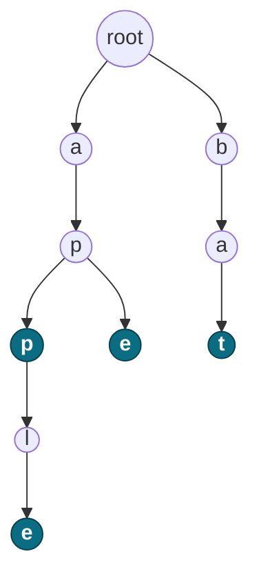

# 🌳 Trie

A tree of characters. Each edge is one letter, each path from the root spells a prefix, and a flag marks where real words end.

<sub>`Last updated: 30 Aug 2026`</sub>

**Contents** — [1 Why](#1-why-a-trie) · [2 Structure](#2-structure) · [3 The node](#3-the-node) · [4 Implementation](#4-implementation) · [5 Prefix vs word](#5-prefix-vs-word) · [6 Trie II](#6-trie-ii-counting-and-deleting) · [7 Complexity](#7-complexity) · [8 Array vs HashMap](#8-array-vs-hashmap) · [9 Where it is used](#9-where-it-is-used) · [10 Practice](#10-practice-problems)

---

## 1. Why a Trie

A `HashSet` answers *"does `apple` exist?"* instantly. It is useless for:

> Does **any** word start with `app`?  ·  Give me **all** words starting with `ap`.

Those need a full scan in a set. A Trie answers them by walking down the tree, one character at a time.

## 2. Structure

Words `apple`, `app`, `ape`, `bat`:



Filled nodes have `isEnd = true` — they finish a real word.

`apple` and `app` share the path `a → p → p`, stored **once**. That sharing is the whole point, and it is why a dictionary Trie is far smaller than you would guess.

## 3. The node

```java
class TrieNode {
    TrieNode[] children = new TrieNode[26];   // one slot per letter a-z
    boolean isEnd;                            // a word ends here
}
```

Character to index: `int index = ch - 'a';` → `'a'`=0, `'c'`=2, `'z'`=25.

> [!WARNING]
> Only works for lowercase `a-z`. Uppercase, digits or spaces give an out-of-range index and throw `ArrayIndexOutOfBoundsException`. For anything else use the [HashMap version](#8-array-vs-hashmap).

## 4. Implementation

```java
class Trie {
    private TrieNode root = new TrieNode();

    public void insert(String word) {
        TrieNode curr = root;
        for (char ch : word.toCharArray()) {
            int i = ch - 'a';
            if (curr.children[i] == null) {
                curr.children[i] = new TrieNode();
            }
            curr = curr.children[i];
        }
        curr.isEnd = true;
    }

    public boolean search(String word) {
        TrieNode node = walk(word);
        return node != null && node.isEnd;    // must be a complete word
    }

    public boolean startsWith(String prefix) {
        return walk(prefix) != null;          // reaching the node is enough
    }

    private TrieNode walk(String s) {
        TrieNode curr = root;
        for (char ch : s.toCharArray()) {
            int i = ch - 'a';
            if (curr.children[i] == null) return null;
            curr = curr.children[i];
        }
        return curr;
    }
}
```

`search` and `startsWith` are the **same walk**. Only the last line differs.

<details>
<summary>Insert, step by step — <code>insert("cat")</code></summary>

Each character: if the child is missing, make it; then move into it.

```text
root      root      root      root
           |         |         |
           c         c         c
                     |         |
                     a         a
                               |
                               t*      <- curr.isEnd = true
```

Without that last line the nodes exist but `search("cat")` returns `false`.

</details>

## 5. Prefix vs word

Insert only `apple`. Now call both methods with `"app"` — both reach the same node:

| Call | Checks | Result |
|---|---|:--:|
| `startsWith("app")` | Did we reach the node? | ✅ `true` |
| `search("app")` | Reached the node **and** `isEnd`? | ❌ `false` |

`"app"` exists as a **path** but was never inserted as a **word**.

> [!IMPORTANT]
> A Trie stores prefixes. `isEnd` is what turns a prefix into a word. Every word is a prefix; not every prefix is a word.

## 6. Trie II: counting and deleting

To support duplicates and deletion, replace the boolean with **two counters**:

| Field | Meaning | Updated |
|---|---|---|
| `countEnd` | Words ending **exactly** here | Last node only |
| `countPrefix` | Words **passing through** here | Every node on the path |

```java
class TrieNode {
    TrieNode[] children = new TrieNode[26];
    int countEnd;
    int countPrefix;
}

public void insert(String word) {
    TrieNode curr = root;
    for (char ch : word.toCharArray()) {
        int i = ch - 'a';
        if (curr.children[i] == null) curr.children[i] = new TrieNode();
        curr = curr.children[i];
        curr.countPrefix++;              // every node on the path
    }
    curr.countEnd++;                     // only the last one
}

public int countWordsEqualTo(String word) {
    TrieNode node = walk(word);
    return node == null ? 0 : node.countEnd;
}

public int countWordsStartingWith(String prefix) {
    TrieNode node = walk(prefix);
    return node == null ? 0 : node.countPrefix;
}

public void erase(String word) {
    if (countWordsEqualTo(word) == 0) return;    // never go negative

    TrieNode curr = root;
    for (char ch : word.toCharArray()) {
        int i = ch - 'a';
        TrieNode next = curr.children[i];
        next.countPrefix--;

        if (next.countPrefix == 0) {   // nothing else lives down here
            curr.children[i] = null;   // cut the subtree, free the memory
            return;
        }
        curr = next;
    }
    curr.countEnd--;
}
```

After `insert("app")`, `insert("apple")`, `insert("app")`:

```text
a(3) → p(3) → p(3, end=2) → l(1) → e(1, end=1)
                    ↑
        countWordsEqualTo("app")      = 2
        countWordsStartingWith("app") = 3
```

Three things to say out loud:

1. **Decrement on the way down.** Updating `countPrefix` as you walk keeps every ancestor correct in one pass.
2. **Guard `erase`.** Without the zero check the counters go negative and every later query is silently wrong.
3. **The `countPrefix == 0` cut is the memory win.** No words pass through, so the subtree is unreachable — drop it. Skip this and the Trie only grows.

## 7. Complexity

`L` = length of the word or prefix. **Every operation is `O(L)`** — insert, search, startsWith, the counters, erase.

Cost depends on word length, not on how many words are stored: a Trie with a million words searches as fast as one with ten.

**Space:** `O(N × L)` for `N` words — a loose upper bound, since shared prefixes mean the real node count is much lower.

## 8. Array vs HashMap

```java
TrieNode[] children = new TrieNode[26];              // option 1
Map<Character, TrieNode> children = new HashMap<>(); // option 2
```

| | Advantage | Disadvantage |
|---|---|---|
| `TrieNode[26]` | Fast `O(1)` lookup, simple to write under pressure | 26 slots per node even if one is used; fixed alphabet |
| `HashMap` | Any character set — `A-Z`, digits, Unicode; less memory on sparse nodes | Slightly more overhead per lookup |

> [!TIP]
> If the problem says *"lowercase English letters"*, use the array — it is what the interviewer expects. Otherwise use the map and say why.

## 9. Where it is used

| Application | How the Trie is used |
|---|---|
| **Autocomplete** | Walk to the prefix node, collect the words below it |
| **Spell checker** | Search the word; if missing, walk allowing a few edits and suggest what you find |
| **IP routing** | A binary Trie over address bits, taking the **longest matching prefix** |
| **Predictive text (T9)** | One digit maps to several letters, so you walk several branches at once |
| **Word games** (Boggle, Scrabble) | Abandon a board path the moment it stops being a prefix |
| **IDE completion** | Autocomplete over class and method names |
| **URL routing** | Frameworks match request paths by prefix |

<details>
<summary>Autocomplete — the two steps</summary>

1. **Walk** to the prefix node — this is `startsWith`, `O(L)`.
2. **Collect** — DFS from there, gathering every path with `isEnd = true`.

```java
private void collect(TrieNode node, StringBuilder path, List<String> out) {
    if (node.isEnd) out.add(path.toString());

    for (int i = 0; i < 26; i++) {
        if (node.children[i] != null) {
            path.append((char) ('a' + i));
            collect(node.children[i], path, out);
            path.deleteCharAt(path.length() - 1);   // backtrack
        }
    }
}
```

The point: step 2 only searches **inside the subtree**, never the rest of the dictionary.

**Scaling it:** real autocomplete returns the best few, not all matches — so production versions keep a **top-k list or frequency count on each node**, and skip the DFS entirely.

</details>

<details>
<summary>Spell check — why a Trie beats a word list</summary>

`search(word)` first. If it fails, look for words within one or two edits. At each node you can:

| Edit | Move |
|---|---|
| **Replace** | Follow a different child than the typed character |
| **Insert** | Follow a child without consuming a character |
| **Delete** | Skip the character, stay on the node |

Each costs one from the edit budget; at zero you stop descending.

Comparing a typo against 100,000 words is slow. In a Trie, once the path `xzq` has no children, **every** word starting with `xzq` is ruled out at once.

</details>

## 10. Practice problems

| Problem | Why |
|---|---|
| Implement Trie | The class in §4. Write it in 5 minutes. |
| Implement Trie II | The counters in §6 |
| Design add and search words | Adds `.` wildcards, forcing recursion over children |
| Replace words | Insert a dictionary, walk each word to the first `isEnd` |
| Search suggestions system | Autocomplete — walk, then collect |
| Word search II | Trie + grid DFS. The hard one; save it for last. |

---

<sub>**Remember:** a Trie is a tree of characters where each path from the root is a prefix, and `isEnd` (or `countEnd`) tells you whether that path is a complete word.</sub>
