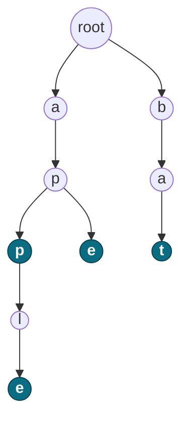
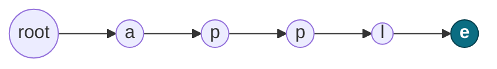
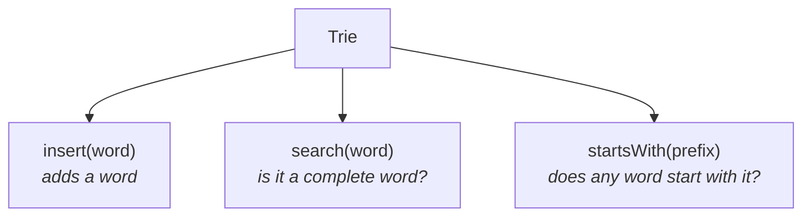
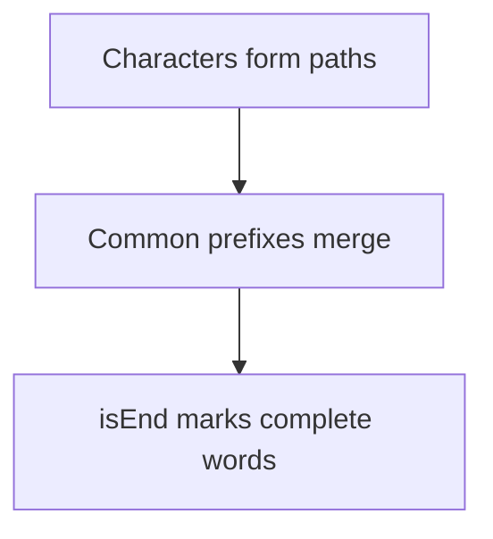

<div align="center">

# 🌳 Trie

**A tree of characters, built for prefixes**

A Trie (pronounced *"try"*) stores strings so that **prefix questions become cheap**.
Each edge is one character, and every path from the root spells a prefix.

`Last updated: 30 Aug 2026`

</div>

---

> [!TIP]
> **The one line to remember:** a Trie is a tree of characters where each path from the root is a prefix, and `isEnd` tells you whether that path is also a **complete word**.

## Table of contents

| # | Section | What is inside |
|:--:|---|---|
| ⭐ 1 | [Why do we need a Trie](#1-why-do-we-need-a-trie) | What a HashSet cannot do well |
| ⭐ 2 | [Trie structure](#2-trie-structure) | Shared prefixes, drawn out |
| 3 | [The Trie node](#3-the-trie-node) | `children[26]` and `isEnd`, and why 26 |
| ⭐ 4 | [Complete Java implementation](#4-complete-java-implementation) | The whole class, ready to write from memory |
| 5 | [How insert works](#5-how-insert-works) | Step by step, one character at a time |
| ⭐ 6 | [Why isEnd matters](#6-why-isend-matters) | The difference between a prefix and a word |
| ⭐ 7 | [startsWith vs search](#7-startswith-vs-search) | The most asked Trie question |
| 8 | [Complexity](#8-complexity) | Time and space |
| ⭐ 9 | [Core Trie logic](#9-core-trie-logic) | The 5 lines everything is built on |
| 10 | [Trie operations](#10-trie-operations) | insert, search, startsWith |
| 11 | [Array vs HashMap](#11-array-vs-hashmap) | Which to pick, and what to say |
| ⭐ 12 | [When to think of Trie](#12-when-to-think-of-trie) | Keywords that give it away |
| ⭐ 13 | [Real world applications](#13-real-world-applications) | Autocomplete, spell check, routing, word games |
| 14 | [Mental model](#14-mental-model) | How to hold it in your head |
| 15 | [Practice problems](#15-practice-problems) | The classic ones |

---

## 1. Why do we need a Trie

Suppose we store these words:

```text
apple
app
ape
bat
ball
```

A normal `HashSet` answers this instantly:

> Does `apple` exist?

But it is bad at these:

> Does **any** word start with `app`?
>
> Give me **all** words starting with `ap`.

With a `HashSet` you would have to scan every word. A Trie answers both by walking down the tree, one character at a time.

| Question | HashSet | Trie |
|---|---|---|
| Does this exact word exist? | ✅ O(L) | ✅ O(L) |
| Does any word start with this prefix? | ❌ scan everything | ✅ O(L) |
| List all words with this prefix | ❌ scan everything | ✅ walk the subtree |

<sub>[⬆ back to top](#table-of-contents)</sub>

---

## 2. Trie structure

For the words `apple`, `app`, `ape`, `bat`:



The **filled nodes** are the ones where `isEnd = true` — they finish a real word: `app`, `ape`, `bat`, `apple`.

### Common prefixes are shared

`apple` and `app` both share:

```text
a → p → p
```

Instead of storing `app` and `apple` separately, the Trie stores that prefix **once**. That is the whole trick — and it is why a Trie holding a dictionary is much smaller than you would expect.

<sub>[⬆ back to top](#table-of-contents)</sub>

---

## 3. The Trie node

A node needs exactly two things:

| Field | Purpose |
|---|---|
| `children` | References to the next characters |
| `isEnd` | Does a complete word end at this node? |

```java
class TrieNode {
    TrieNode[] children = new TrieNode[26];
    boolean isEnd;
}
```

**Why 26?** One slot per lowercase English letter:

```text
children[0]  → a
children[1]  → b
children[2]  → c
...
children[25] → z
```

Convert a character to an index by subtracting `'a'`:

```java
int index = ch - 'a';
```

```text
'a' - 'a' = 0
'c' - 'a' = 2
'z' - 'a' = 25
```

> [!WARNING]
> This only works for **lowercase a–z**. An uppercase letter, a digit or a space gives a negative or out-of-range index and throws `ArrayIndexOutOfBoundsException`. If the input is not guaranteed lowercase, use the [HashMap version](#11-array-vs-hashmap).

<sub>[⬆ back to top](#table-of-contents)</sub>

---

## 4. Complete Java implementation

```java
class TrieNode {
    TrieNode[] children = new TrieNode[26];
    boolean isEnd;
}

class Trie {

    private TrieNode root;

    public Trie() {
        root = new TrieNode();
    }

    public void insert(String word) {
        TrieNode curr = root;

        for (char ch : word.toCharArray()) {
            int index = ch - 'a';

            if (curr.children[index] == null) {
                curr.children[index] = new TrieNode();
            }

            curr = curr.children[index];
        }

        curr.isEnd = true;
    }

    public boolean search(String word) {
        TrieNode curr = root;

        for (char ch : word.toCharArray()) {
            int index = ch - 'a';

            if (curr.children[index] == null) {
                return false;
            }

            curr = curr.children[index];
        }

        return curr.isEnd;      // must be a complete word
    }

    public boolean startsWith(String prefix) {
        TrieNode curr = root;

        for (char ch : prefix.toCharArray()) {
            int index = ch - 'a';

            if (curr.children[index] == null) {
                return false;
            }

            curr = curr.children[index];
        }

        return true;            // reaching the node is enough
    }
}
```

> [!NOTE]
> `search` and `startsWith` are the **same walk**. The only difference is the last line: `search` also checks `isEnd`, `startsWith` does not.

<sub>[⬆ back to top](#table-of-contents)</sub>

---

## 5. How insert works

Take `trie.insert("cat")`. We start with just a root:

<details>
<summary><b>Step 1 — insert <code>c</code></b></summary>

`children['c' - 'a']` is null, so we make a new node and move into it.

```text
root
 |
 c
```

</details>

<details>
<summary><b>Step 2 — insert <code>a</code></b></summary>

```text
root
 |
 c
 |
 a
```

</details>

<details>
<summary><b>Step 3 — insert <code>t</code></b></summary>

```text
root
 |
 c
 |
 a
 |
 t
```

</details>

<details>
<summary><b>Step 4 — mark the end</b></summary>

After the loop finishes:

```java
curr.isEnd = true;
```

```text
root
 |
 c
 |
 a
 |
 t*        <- * means isEnd = true
```

Without this line the word would be invisible to `search`, even though every node exists.

</details>

<sub>[⬆ back to top](#table-of-contents)</sub>

---

## 6. Why isEnd matters

Insert only the word `app`:

```text
a → p → p*
```

| Call | Result | Why |
|---|:--:|---|
| `search("app")` | ✅ `true` | We reach the final `p`, and it has `isEnd = true` |
| `search("ap")` | ❌ `false` | We reach `a → p`, but that node has `isEnd = false` |

> [!IMPORTANT]
> A Trie stores **prefixes**. `isEnd` is what turns a prefix into a **word**.
> Every word is a prefix; not every prefix is a word.

<sub>[⬆ back to top](#table-of-contents)</sub>

---

## 7. startsWith vs search

This is the question that gets asked. Suppose the Trie contains **only** `apple`:



Now call both methods with `"app"`. Both walk the same path and both arrive at the second `p`:

```text
root → a → p → p
```

From there they behave differently:

| Call | What it checks | Result |
|---|---|:--:|
| `startsWith("app")` | Did we reach the node? Yes. It does not look at `isEnd`. | ✅ `true` |
| `search("app")` | Did we reach the node **and** is `isEnd` true? The node's `isEnd` is `false`. | ❌ `false` |

`"app"` exists as a **path**, but it was never inserted as a **word**.

<sub>[⬆ back to top](#table-of-contents)</sub>

---

## 8. Complexity

Let `L` be the length of the word or prefix.

| Operation | Time |
|---|:--:|
| `insert` | `O(L)` |
| `search` | `O(L)` |
| `startsWith` | `O(L)` |

The cost depends on the **length of the word**, not on how many words are stored. A Trie with a million words searches just as fast as one with ten.

### Space

For `N` words of average length `L`:

```text
O(N × L)
```

That is a rough upper bound. In practice common prefixes are shared, so the real node count is usually much smaller.

<sub>[⬆ back to top](#table-of-contents)</sub>

---

## 9. Core Trie logic

Every Trie method is built on the same five lines. If you remember only one thing, remember this:

```java
int index = ch - 'a';

if (curr.children[index] == null) {
    curr.children[index] = new TrieNode();   // insert only
}

curr = curr.children[index];
```

The shape is always:

```text
       ROOT
        |
   character
        |
   character
        |
   character
        |
      END?
```

`insert` creates the node when it is missing. `search` and `startsWith` return `false` instead.

<sub>[⬆ back to top](#table-of-contents)</sub>

---

## 10. Trie operations



```java
trie.insert("apple");        // add a word
trie.search("apple");        // true  - complete word
trie.search("app");          // false - only a prefix
trie.startsWith("app");      // true  - a word starts with it
```

<sub>[⬆ back to top](#table-of-contents)</sub>

---

## 11. Array vs HashMap

Two common ways to store children.

### Option 1 — array

```java
TrieNode[] children = new TrieNode[26];
```

- Very fast, `O(1)` child lookup
- Simple to write under time pressure
- Good when the character set is known, e.g. lowercase `a-z`
- ❌ Uses more memory — 26 slots per node even if only one is used
- ❌ Fixed character set

### Option 2 — HashMap

```java
Map<Character, TrieNode> children = new HashMap<>();
```

Useful when the character set is not fixed: `a-z`, `A-Z`, `0-9`, special characters, Unicode.

### Comparison

| Approach | Advantage | Disadvantage |
|---|---|---|
| `TrieNode[26]` | Faster, simple | More memory, fixed alphabet |
| `HashMap<Character, TrieNode>` | Flexible, memory-efficient for sparse nodes | Slightly more overhead per lookup |

> [!TIP]
> **Interview rule.** If the problem says *"lowercase English letters"*, use `TrieNode[26]` — it is what the interviewer expects.
> If the character set is arbitrary or large, use `HashMap<Character, TrieNode>` and say why.

<sub>[⬆ back to top](#table-of-contents)</sub>

---

## 12. When to think of Trie

Trie should come to mind the moment a problem involves:

- Prefix searching
- Autocomplete
- Dictionary lookup
- Word search
- Finding words with a common prefix
- Longest common prefix
- Spell checking
- IP routing / prefix matching
- Word games

**Keywords in the problem statement that give it away:**

```text
"starts with"
"prefix"
"autocomplete"
"dictionary"
"find words matching..."
```

<sub>[⬆ back to top](#table-of-contents)</sub>

---

## 13. Real world applications

Naming these is easy. What earns marks is explaining **how** the Trie is used in each one.

| Application | How the Trie is used |
|---|---|
| **Autocomplete / search suggestions** | Walk to the prefix node, then collect the words in the subtree below it |
| **Spell checker** | Search the word; if it is missing, walk the Trie allowing a small number of edits and suggest what you find |
| **IP routing** | A binary Trie over the bits of an address, picking the **longest matching prefix** |
| **Predictive text (T9)** | Each digit maps to several letters, so you walk several branches at once |
| **Word games** (Boggle, Scrabble) | Abandon a path on the board the moment it stops being a prefix |
| **IDE code completion** | Same as autocomplete, over class and method names |
| **Contact / dictionary search** | Type-as-you-go lookup on a phone |
| **URL routing** | Web frameworks match request paths by prefix |
| **Bioinformatics** | Matching DNA sequences with suffix tries |

<details>
<summary><b>Autocomplete — how it actually works</b></summary>

Two steps:

1. **Walk** to the node for the prefix the user typed. This is exactly `startsWith`, so it costs `O(L)`.
2. **Collect** — run a DFS from that node and gather every path that has `isEnd = true`.

```java
// after walking to the prefix node
private void collect(TrieNode node, StringBuilder path, List<String> out) {
    if (node.isEnd) out.add(path.toString());

    for (int i = 0; i < 26; i++) {
        if (node.children[i] != null) {
            path.append((char) ('a' + i));
            collect(node.children[i], path, out);
            path.deleteCharAt(path.length() - 1);   // backtrack
        }
    }
}
```

The whole point is that step 2 only searches **inside the subtree**, never the rest of the dictionary.

> [!TIP]
> Real autocomplete does not return every match — it returns the best few. Production versions store a **top-k list or a frequency count on each node**, so the answer is ready without a DFS. If an interviewer asks "how would you scale this?", that is the answer.

</details>

<details>
<summary><b>Spell checker — how it actually works</b></summary>

First run `search(word)`. If it returns `true`, the word is spelled correctly and you are done.

If it returns `false`, you look for words that are **close** — within one or two edits (a wrong letter, a missing letter, an extra letter). At each node you try:

| Edit | What you do |
|---|---|
| **Replace** | Follow a different child than the typed character |
| **Insert** | Follow a child without consuming a character |
| **Delete** | Skip the typed character and stay on the same node |

Each of those costs one from your edit budget. When the budget hits zero you stop going deeper.

**Why a Trie instead of a list?** Comparing the typo against all 100,000 dictionary words is slow. In a Trie, once the path `xzq` has no children, every word starting with `xzq` is eliminated at once. The shared prefixes do the pruning for you.

</details>

<details>
<summary><b>IP routing — longest prefix match</b></summary>

A router has rules like *"anything starting with `192.168.` goes to port 3"*. Addresses are stored as **bits**, so each node has only two children — `0` and `1`.

To route a packet, the router walks down the bits of the destination address and remembers the **deepest** node that carried a rule. That is the longest matching prefix, and it wins.

This is a Trie doing exactly what it is good at: matching the longest prefix in time proportional to the address length, not to the number of rules.

</details>

<details>
<summary><b>Word games — pruning a search</b></summary>

In Boggle or Word Search II you explore the board with DFS. Without a Trie you would explore every path and check the dictionary at the end.

With a Trie you carry the current node along with the DFS. The moment the path so far is not a prefix in the Trie, you **stop immediately** — no word can grow from there. That single check is what turns an impossible search into a fast one.

</details>

<sub>[⬆ back to top](#table-of-contents)</sub>

---

## 14. Mental model



For the words `app`, `apple`, `ape`, `bat`:

```text
              root
             /    \
            a      b
            |      |
            p      a
           / \      \
          p*  e*     t*
          |
          l
          |
          e*
```

> **A Trie is a tree of characters where each path from the root represents a prefix, and `isEnd` tells us whether that path represents a complete word.**

<sub>[⬆ back to top](#table-of-contents)</sub>

---

## 15. Practice problems

The classic set — solving the first two covers most of what gets asked.

| Problem | Why it matters |
|---|---|
| Implement Trie (prefix tree) | The exact class above. Learn to write it in 5 minutes. |
| Design add and search words | Adds `.` wildcard matching, which forces recursion over children |
| Longest common prefix | Can be done without a Trie, but the Trie solution shows you understand the structure |
| Replace words | Insert a dictionary, then walk each word until you hit an `isEnd` |
| Search suggestions system | Autocomplete — walk to the prefix node, then collect words below it |
| Word search II | Trie + DFS on a grid. The hard one; only attempt after the rest are comfortable. |

<sub>[⬆ back to top](#table-of-contents)</sub>
